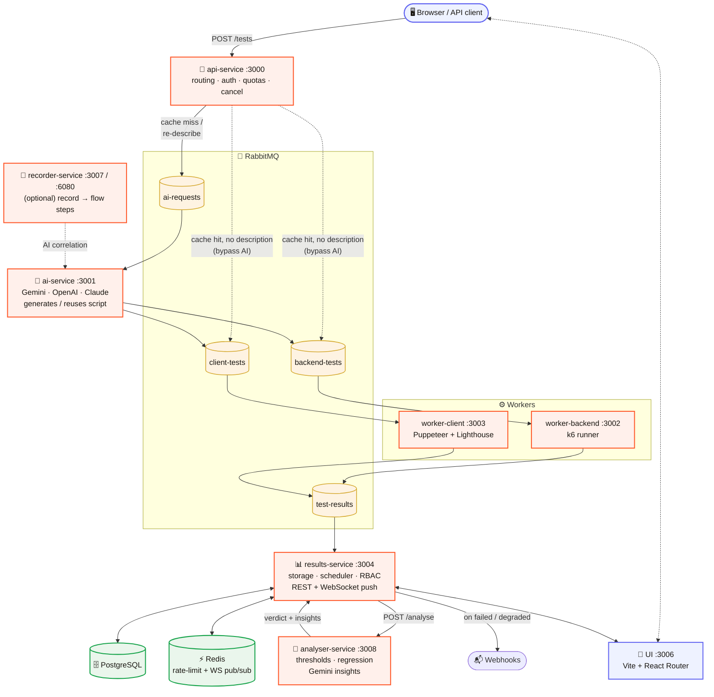

# AI Load Testing Platform

A distributed, AI-powered load testing platform. Describe what you want to test — Gemini AI generates the k6 or Puppeteer script automatically — then track live metrics, compare results, and get automated performance analysis.

---

## Features

- 💬 **Chat-based test creation** — Describe a test in a multi-turn conversation; the assistant asks follow-up questions for anything ambiguous (test type, load amount, duration) instead of guessing
- 🤖 **AI script generation** — Pluggable provider: Gemini, OpenAI, or Claude (Anthropic) generate the k6 or Puppeteer script, with a configurable fallback chain
- ⚡ **Backend load testing** — k6-powered HTTP tests with VU ramp-up, load profiles (load / spike / capacity / soak), and full metrics (avg, p50, p95, p99, rps, error breakdown)
- 🌐 **Browser testing** — Puppeteer + Lighthouse: Web Vitals (LCP, INP, TBT, CLS, TTFB, FCP) and performance scores
- 🔗 **Multi-step flow testing** — Build authenticated flows with variable extraction and data parameterization
- 🔴 **Flow recording** — Open a visible browser, interact naturally, AI auto-detects correlations
- 📁 **Custom k6 scripts** — Upload or paste your own script; bypass AI entirely
- 📊 **Live metrics** — Real-time charts pushed over WebSocket during k6/Puppeteer execution
- 📈 **Regression detection** — Automatic comparison vs baseline or previous run; 20%+ degradation flagged
- 🎯 **SLO thresholds** — Per-test pass/fail criteria (p95 < Xms, error rate < Y%, LCP < Zms, etc.)
- 🗓️ **Scheduled tests** — Cron-based recurring runs with CRUD API
- 📬 **Webhooks** — Fire on `failed` or `degraded` results with optional HMAC signatures
- 📄 **PDF & CSV reports** — Downloadable report per test result
- 👥 **Teams, orgs & RBAC** — User accounts, multi-team membership, admin/member/viewer roles, per-team quotas, audit log, and one-click data erasure
- 🔑 **API key auth + CORS** — Per-team API keys for CI/external callers, production-ready security out of the box
- 🛡️ **LLM guardrails** — Every AI response is schema-validated before use; user-supplied text is fenced against prompt injection before reaching a prompt
- 🔭 **LLM observability** — Every AI call optionally traced to Langfuse (prompt, completion, which provider served it)
- 🚀 **HTTPS via Caddy** — Automatic TLS certificates in production

---

## Architecture



Two paths aren't shown above to keep the diagram readable:
- **Cancel** — `POST /tests/:id/cancel` → `api-service` → `results-service` (marks the row cancelled) → broadcasts on a `cancel-fanout` exchange that every worker replica listens to.
- **Scheduled runs** — a `node-cron` job inside `results-service` calls `POST /tests` on a cron schedule, joining the same flow as a normal user-submitted test.

---

## Quick Start

**Prerequisites:** Docker + Docker Compose, a [Gemini API key](https://aistudio.google.com/app/apikey) (free tier works).

```bash
# 1. Clone
git clone https://github.com/artem-rybalkin/ai-load-testing-platform.git
cd ai-load-testing-platform

# 2. Configure
echo "GEMINI_API_KEY=your_key_here" > .env

# 3. Start everything
docker compose up --build

# 4. Open the UI
# → http://localhost:3006
```

First startup takes ~2–3 minutes to build all images. After that, the UI is served by Vite, which
pre-bundles vendor chunks at server startup rather than compiling them lazily on first browser
request — no `ERR_CONNECTION_RESET` workaround needed even on Docker Desktop's slower Windows
filesystem bridge (see [Vite Migration](docs/vite-migration.md) for why this used to be a problem
under the previous Next.js-based UI).

| What | URL |
|------|-----|
| UI dashboard | http://localhost:3006 |
| API (Swagger-style) | http://localhost:3000 |
| Results & data API | http://localhost:3004 |
| RabbitMQ management | http://localhost:15672 (user: `alt_user`, pass: `alt_password`) |
| noVNC browser viewer | http://localhost:6080 (recorder-service only) |

---

## Services

| Service | Port | Description |
|---------|------|-------------|
| `api-service` | 3000 | Fastify REST API — test routing and cancellation |
| `ai-service` | 3001 | Pluggable AI integration (Gemini / OpenAI / Claude) — script generation and comparison |
| `worker-backend` | 3002 | k6 runner — backend + flow tests |
| `worker-client` | 3003 | Puppeteer + Lighthouse — browser tests |
| `results-service` | 3004 | PostgreSQL storage, REST API + WebSocket, scheduler, auth/RBAC |
| `ui` | 3006 | Vite + React Router dashboard |
| `recorder-service` | 3007 / 6080 | CDP-based flow recorder + noVNC browser viewer |
| `analyser-service` | 3008 | Deterministic threshold/regression analysis + Gemini AI insights |
| `postgres` | 5432 | Main database |
| `rabbitmq` | 5672 / 15672 | Message queue (management UI on 15672) |
| `redis` | 6379 | Backs rate limiting and WebSocket pub/sub across replicas |

---

## Documentation

| Guide | Description |
|-------|-------------|
| [Getting Started](docs/how-to/getting-started.md) | Zero-to-running in 5 minutes |
| [Test Types](docs/how-to/test-types.md) | Backend, Browser, and Flow tests explained |
| [Flow Recording](docs/how-to/flow-recording.md) | Record a browser session and convert to a test |
| [Custom Scripts](docs/how-to/custom-scripts.md) | Upload your own k6 script |
| [API Reference](docs/api.md) | Full REST API for all services |
| [Configuration](docs/configuration.md) | All environment variables and tuning options |
| [Production Deployment](docs/how-to/production.md) | Caddy HTTPS, DNS, security hardening |
| [Development Guide](docs/how-to/development.md) | Hot-reload dev mode, test suite, adding services |
| [Grafana Integration](docs/how-to/grafana-integration.md) | Connect Prometheus, Loki, and Tempo for AI-enriched analysis |
| [AI Features](docs/AI-FEATURES.md) | Every AI capability, including LLM observability and guardrails |
| [Vite Migration](docs/vite-migration.md) | Why Next.js was replaced, what failed, final solution |

---

## Quick Examples

### Run a backend load test via API

```bash
curl -X POST http://localhost:3000/tests \
  -H "Content-Type: application/json" \
  -d '{
    "type": "backend",
    "targetUrl": "https://httpbin.org/get",
    "description": "Load test with 20 VUs for 1 minute",
    "options": { "vus": 20, "duration": "1m" }
  }'
```

### Run a browser test

```bash
curl -X POST http://localhost:3000/tests \
  -H "Content-Type: application/json" \
  -d '{
    "type": "client-side",
    "targetUrl": "https://example.com",
    "description": "Measure Web Vitals with 3 concurrent sessions",
    "options": { "sessions": 3, "duration": "30s", "collectWebVitals": true }
  }'
```

### Set SLO thresholds

```bash
curl -X POST http://localhost:3000/tests \
  -H "Content-Type: application/json" \
  -d '{
    "type": "backend",
    "targetUrl": "https://api.example.com",
    "description": "API load test",
    "options": { "vus": 50, "duration": "2m" },
    "thresholds": { "p95": 500, "errorRate": 1 }
  }'
```

---

## License

MIT
