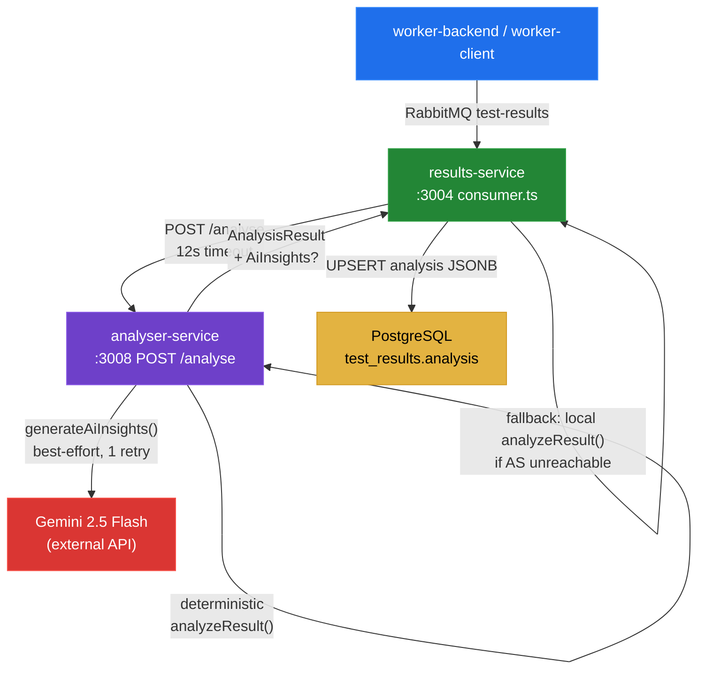

# module-analyser-service — Deterministic Analysis & AI Insights

Grounded code analysis of `services/analyser-service`. Every claim is anchored to file:line evidence.

---

## Business Logic Overview

analyser-service is responsible for two consecutive operations executed per completed test:

1. **Deterministic threshold evaluation** — compares current metrics against fixed or user-supplied SLO thresholds; computes regression diffs against the previous run; emits `perfStatus` (`passed` | `degraded` | `failed`).
2. **Gemini AI narrative** — uses the deterministic output as structured context to produce natural-language `narrative`, `anomalies`, `rootCauses`, `recommendations`, and `severity`.

The service is called by results-service immediately after a test result arrives on the `test-results` RabbitMQ queue (`consumer.ts:80-91`). results-service supplies a 12 s `AbortSignal.timeout` and falls back to its local `analyzeResult()` copy if the HTTP call fails or times out (`consumer.ts:86-91`).

---

## Architecture Overview

---

## Component Analysis

### index.ts — HTTP surface

`/health` (line 11-21): always returns `200`; reports `gemini: 'missing_key'` when `GEMINI_API_KEY` is absent but does not degrade. This is intentionally correct — AI is optional.

`POST /analyse` (line 32-61): no authentication. The endpoint is internal (not exposed via Caddy in prod) and results-service is the only caller. For the current single-tenant architecture this is acceptable, but any future exposure to the public gateway would require the same `X-API-Key` guard applied to api-service and results-service.

`AnalyseBody` interface (line 23-30): accepts `metrics`, `previousMetrics`, and `thresholds` typed as the correct shared types. However the handler performs no runtime validation — Fastify's built-in schema validation (`schema: { body: ... }`) is unused. Malformed or missing fields are caught only at the TypeScript cast boundary. If results-service sends a result with `metrics: null` (e.g. a race condition where the worker sent incomplete data), `analyzeResult()` would throw and the endpoint would return a 500, causing results-service to fall back to its local copy — which would encounter the same `null` and also throw. This is a latent double-fault path.

### analyzer.ts — deterministic logic

Structurally identical to `results-service/src/analyzer.ts`. The two files diverge only at the `analyzeResult` return type annotation: analyser-service returns `Omit<AnalysisResult, 'aiInsights'>` (line 29 / 108 / 202-206) while results-service returns `AnalysisResult` directly. This is a consequence of the phase-18 refactor that introduced the separate service but did not extract the shared logic into `@alt/shared`.

Duplication is verbatim: thresholds constants, `getDiffStatus`, `analyzeBackend`, `analyzeClient`, and the outer `analyzeResult` dispatcher are character-for-character copies with only Ukrainian inline comments absent from the analyser-service copy. Any future threshold change (e.g. widening the p95 default from 1000 ms to 1200 ms) must be applied in both files. There is no automated guard against drift.

### aiInsights.ts — Gemini integration

`buildPrompt` (line 58-108): formats metric values before embedding them in the prompt. `formatBackendMetrics` (line 19-41) and `formatClientMetrics` (line 43-56) pre-render all numeric fields as rounded integers or fixed decimals before the prompt string is assembled. This is the positive side of the known tech-debt item: numbers are not raw floats, units are explicit (`ms`, `req/s`, `%`).

The negative side: `targetUrl` is embedded directly at line 79 (`- URL: ${ctx.targetUrl}`) without sanitisation. A URL containing a newline character or the exact string `Respond ONLY with a valid JSON object` would perturb the prompt structure. In practice Gemini is resilient to mild injections and the URL is validated upstream by api-service (`new URL()` check), but the analyser-service itself does not re-validate. `stepMetrics` are included verbatim at line 38 (`s.name` is flow step names authored by the user), which is a weak but real injection surface for the step-name field.

Retry policy (line 120-163): 2 attempts with a 3 s back-off between them. On 429/quota the function returns `null` immediately (line 148-150). On `SyntaxError` (JSON parse failure) it also returns `null` immediately without retrying (line 151-155), which is correct — a parse failure will not self-heal on retry with the same input. Other errors retry once. This is conservative and appropriate given the 12 s budget granted by results-service.

`genAI` is instantiated at module load with the current value of `GEMINI_API_KEY` (line 6). If the key is rotated at runtime the process must restart to pick up the new value. This is a minor operational note, not a bug.

### logger.ts

Minimal Pino configuration (line 1-6). Missing the `redact` configuration present in all other service loggers (api-service, results-service, worker-backend). The analyser-service receives `metrics` and `targetUrl` in the request body. While the body itself is not logged at the info level, a future `testLog.info(request.body, ...)` call would leak full metric payloads. The redact safety net present elsewhere is absent here.

### Dockerfile

Follows the established project pattern: root-level `RUN npm install`, copy source, build shared, `chown -R node:node /app`, `USER node` (line 17-22). Correct.

`CMD ["npx", "tsx", "src/index.ts"]` (line 26): runs TypeScript directly via `tsx` in production. This is consistent with other services in this project but skips the ahead-of-time compilation step. For a single-endpoint analysis service the cold-start overhead is negligible.

---

## Design Patterns & Anti-patterns

| Pattern | Verdict | Evidence |
|---|---|---|
| Separation of concerns (AI vs deterministic) | Correct | `index.ts:39-51` — two discrete steps, sequential, results composed |
| Best-effort AI with guaranteed fallback | Correct | `consumer.ts:80-91` — `?? analyzeResult()` guarantees result always saved |
| Verbatim code duplication across services | Anti-pattern | `analyzer.ts` is byte-for-byte copy of `results-service/src/analyzer.ts` |
| No input schema validation on HTTP endpoint | Risk | `index.ts:32` — `AnalyseBody` is a TypeScript interface only; no Fastify JSON schema |
| User-controlled string in AI prompt without sanitisation | Weak injection surface | `aiInsights.ts:79` — `ctx.targetUrl` and `ctx.metrics.stepMetrics[].name` embedded raw |
| Missing Pino redact on logger | Defensive coding gap | `logger.ts:1-6` — no `redact` field vs all other services |

---

## Data Architecture

The service is stateless. It receives a self-contained `AnalyseBody` payload and returns `AnalysisResult`. No database connections, no queue connections, no persistent state. This is architecturally clean: horizontal scaling is trivially safe and the service can be restarted without consequence.

The `AnalysisResult` type from `@alt/shared` carries `aiInsights?: AiInsights`. The merge at `index.ts:53-56` correctly uses spread with a conditional inclusion so that when `aiInsights` is `null`, the field is absent from the response rather than `null` — this is important because results-service stores the whole object as `analysis JSONB` and the UI checks `aiInsights` presence to conditionally render the panel.

---

## Integration Patterns

**Call chain**: results-service → `callAnalyserService` (12 s timeout) → analyser-service → Gemini (unbounded, but 2-attempt cap with 3 s gap keeps worst case ≈ 6 s under the 12 s budget).

**Fallback correctness**: The `??` operator at `consumer.ts:86` ensures the fallback `analyzeResult()` is only called when `callAnalyserService` returns `null`. `callAnalyserService` returns `null` on: network error, non-2xx status, timeout expiry, and JSON parse failure. All of these are handled via the catch block at `consumer.ts:27-32`. The local fallback produces no `aiInsights` field, which is the correct degraded behaviour.

**Budget analysis**: Gemini call worst case = 3 s delay + two round-trips. Gemini p50 latency for `gemini-2.5-flash` on a modest prompt is ~1-2 s, giving a realistic total of ≈ 5-7 s. The 12 s budget is adequate but leaves only ~5-7 s of margin. If Gemini introduces higher tail latency the 12 s threshold would be hit and results-service would fall back, discarding any in-flight AI call. This is the correct behaviour but means AI insights have a higher miss rate during Gemini congestion than the retry policy alone suggests.

---

## Quality Observations

**Architectural correctness of the separation**: Isolating the Gemini call in a separate service prevents a Gemini outage or quota exhaustion from blocking the results-service consumer loop. The consumer processes one message at a time (`channel.prefetch(1)`) and a synchronous Gemini call inside the consumer would stall the entire pipeline. The HTTP-with-fallback pattern solves this correctly. The decision recorded in `ARCHITECTURE.md:127` ("Isolates Gemini AI from results-service; 12s timeout with local fallback") is justified.

**Analyzer duplication severity**: Medium-high. Both copies are currently in sync. The risk is maintenance drift: a future threshold change, a new metric category, or a bug fix applied to one file but missed in the other would produce inconsistent analysis depending on whether analyser-service was reachable. The fix is to move `analyzeResult` into `packages/shared/src/` (pure function, no Node.js dependencies) and import it in both services.

**Tech debt — untyped prompt payload**: The known debt item ("Strict input contract for analyser-service AI prompt") is real but not catastrophic at current scale. The `formatBackendMetrics` and `formatClientMetrics` functions act as an implicit filter — only the fields they explicitly reference reach the prompt. The risk is token inflation from `stepMetrics` arrays in large flows (line 37-39: all steps are included with no cap). A 20-step flow with long names could produce a noticeably longer prompt and inflate cost. Capping to top-5 steps by p95 would resolve this.

**Security gaps**:
- `targetUrl` injection: low practical risk (URL-validated upstream, Gemini is robust), but a defense-in-depth sanitise (strip newlines, truncate at 200 chars) would close the gap.
- Step names: `m.stepMetrics.map(s => s.name)` — step names are user-authored strings from FlowBuilder. Truncating each name to 60 chars before prompt inclusion is sufficient mitigation.
- No auth on `/analyse`: acceptable for internal-only service; document explicitly in Caddyfile comments to prevent accidental exposure.
- `logger.ts` missing `redact`: add `redact: { paths: ['metrics', 'previousMetrics'], censor: '[REDACTED]' }` to match the project's established pattern.

---

## Engineering Insights

1. **Move `analyzeResult` to `@alt/shared`**: the function has zero Node.js API dependencies (`BackendMetrics`, `ClientMetrics`, `SLOThresholds`, `AnalysisResult`, `MetricDiff` are all plain TypeScript types). Relocating it eliminates the duplication, makes the fallback in results-service import the identical implementation, and removes the drift risk permanently.

2. **Add Fastify JSON schema to `POST /analyse`**: a `required: ['testId', 'targetUrl', 'type', 'metrics']` schema guard converts silent TypeScript assumptions into explicit 400 responses, preventing the double-fault path where both analyser-service and the fallback encounter `null` metrics.

3. **Cap prompt inputs**: in `formatBackendMetrics`, limit `stepMetrics` to the 5 steps with the highest p95. In `buildPrompt`, truncate `targetUrl` to 200 chars and each step name to 60 chars. Both changes are two-line additions.

4. **Add `redact` to `logger.ts`**: follow the pattern established by `api-service/src/logger.ts` — add `redact: { paths: ['metrics', 'previousMetrics'], censor: '[REDACTED]' }`.

5. **Document `/analyse` as internal-only**: add a comment in `docker-compose.yml` and `Caddyfile` explicitly noting that port 3008 must never be exposed on the public gateway. The current prod config does not expose it but this is implicit.
