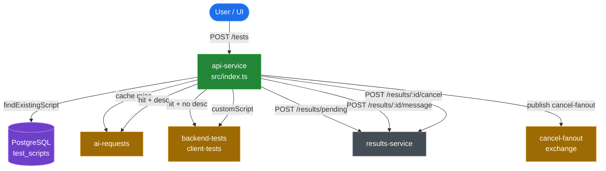

# module-api-service — REST Gateway & Test Router

Single sentence: The api-service is the system's sole public HTTP entry point — it validates requests, executes 3-way script routing, and publishes to RabbitMQ without owning any long-running state.

---

## Business Logic Overview

Every test creation request enters here. The handler in `src/index.ts:79–191` implements a 3-way decision:

1. **Cache miss** — no script stored for this URL/type → publish to `ai-requests`; ai-service generates via Gemini.
2. **Cache hit, no description (or flow test)** — inject new k6 options directly into the cached script body → bypass ai-service, publish straight to the worker queue, increment `used_count`.
3. **Cache hit, description present** — route to `ai-requests` with `cachedScript` + `cachedScriptDescription` attached; ai-service calls `compareDescriptions()` to decide REUSE vs REGENERATE.

A fourth path added in Phase 16 (`customScript`, `src/index.ts:151–159`) bypasses both the cache and ai-service entirely, publishing directly to the worker queue.

Cancellation (`src/index.ts:193–208`) is a thin pass-through: update DB state via results-service, then broadcast to the `cancel-fanout` exchange so every worker replica receives the signal.

---

## Architecture Overview



---

## Component Analysis

### `src/index.ts` — Fastify Application & Route Handler

**`buildApp()` (line 39)** constructs the Fastify instance, registers CORS (`@fastify/cors`), wires the API key `onRequest` hook, and declares two routes. All side-effectful logic (DB lookup, queue publish, results-service calls) lives inside the `POST /tests` handler rather than in dedicated request-scoped services. The handler is ~110 lines long; it is the single largest function in the module.

**`parseDurationSeconds()` (line 8)** converts `30s / 2m / 1h` strings to integer seconds for the `duration_seconds` column. No error path beyond returning `0` for unrecognised input — a silent failure that stores `0` in the DB countdown timer. The function is not exported or independently tested.

**`safeTestResponse()` (line 27)** uses destructuring rest to strip eight sensitive/internal fields before returning to the HTTP caller. The approach is type-safe: TypeScript enforces the `EnrichedTestRequest` input shape, making accidental field omissions a compile-time error.

**`warnIfNoWorker()` (line 138)** is defined as an inner closure inside the route handler on every request, then called fire-and-forget. The closure captures `type`, `test.id`, and `resultsUrl`. Because it is defined inline, it cannot be independently tested; its fire-and-forget `fetch` call silently suppresses errors with `.catch(() => {})` (`line 146`).

**`POST /tests` validation** (lines 84–103):
- Type enum checked manually against `validTypes` array — not using a Fastify schema validator.
- Description length bounded at 500 chars.
- Steps array bounded at 20 entries.
- URL validated via `new URL()` which accepts data URIs, file paths, and other non-HTTP schemes — see Security section.
- No validation of `options` fields (vus, duration, profile); malformed options pass through to the queue.

**`POST /tests/:testId/cancel`** (line 193) calls results-service synchronously, awaits the response, then publishes to RabbitMQ only if results-service reports success. This is correct sequencing: the worker receives the cancel signal only after the DB status is set.

### `src/queue.ts` — RabbitMQ Publisher

**`connectQueue()` (line 19)** performs retry with a fixed 20-attempt / 10-second-delay loop. The single `channel` variable is module-level (`line 15`) — a singleton shared across all concurrent requests. RabbitMQ `amqplib` channels are not thread-safe but Node.js single-threaded event loop makes this safe in practice; however the pattern does not handle channel-level errors (e.g. channel closed by broker) after the initial connection.

**`publishTest()` (line 64)** is a thin routing switch: `skipAI = true` → worker queue, `skipAI = false` → `ai-requests`. The boolean flag couples routing intent to a single parameter; adding a fourth routing mode would require a new boolean or a refactor to an enum/discriminated union.

**`getWorkerConsumerCount()` (line 46)** calls `channel.checkQueue()` — this issues a synchronous RabbitMQ Passive Declare which is a network round-trip per request. No caching or throttling. Under high request volume this adds latency and queue load.

**No reconnect logic** — if RabbitMQ drops the connection after startup, `channel` remains non-null (pointing to a closed channel) and `isQueueConnected()` returns `true` falsely. `publishTest` / `publishCancel` would throw. The health check (`checkQueue`) would return 0 rather than throw in the error path (`line 52`), masking the disconnection.

### `src/scripts.ts` — Script Cache & Options Injection

**`findExistingScript()` (line 21)** does both lookup and options injection in the same function. The options injection (lines 39–43) via `buildK6Options` + `replaceK6Options` is a side effect that mutates the returned `script` field. This is a cohesion concern: a function named `find*` also transforms data.

**`stepsToKey()` (line 8)** produces a stable `flow:<sha256_hex16>` key from SHA-256 of `JSON.stringify(steps)`. The serialization is order-sensitive — two semantically identical step arrays with different property orderings produce different keys. This is a correctness risk if `FlowStep` objects are assembled via different code paths.

**Module-level pool instantiation** (line 13–14): `if (!process.env.DATABASE_URL) throw new Error(...)` executes at import time. This is intentional fail-fast, but it means importing `scripts.ts` in a test without `DATABASE_URL` set would crash unless the module is fully mocked. The test file mocks the entire module, which is the correct mitigation (`index.test.ts:15`).

**`incrementUsedCount()` (line 18)** accepts an optional injected `dbPool` parameter for testability — a clean inversion-of-control pattern consistent across the module.

### `src/options.ts` — k6 Load Profile Builder

**`buildK6Options()` (line 3)** encodes four load profiles (load, spike, capacity, soak) as a switch-based JSON builder. Hardcoded stage timings (`30s`, `1m`, `10s`) are embedded in the function body — they are not configurable at runtime and not documented in-code as design decisions.

**`replaceK6Options()` (line 57)** walks the script character-by-character via a brace-depth counter to find and replace the `export const options` block. This is a fragile text-manipulation approach: it will fail silently if the AI generates the options block with non-standard whitespace, a TypeScript `as const` assertion, or as a `let` instead of `const`. The function returns the unmodified script on failure (`line 62`, `line 84`), which causes the cached options to remain — a silent degradation rather than an explicit error.

### `src/logger.ts`

Minimal Pino configuration with `service: 'api-service'` base field and `redact` on `envVars`, `testData`, `csvData`. The `customScript` field is not in the redact list — if a test object is logged as a whole, a large user-supplied script blob would appear in logs. Given `customScript` can be 512 KB, this is also a log volume concern.

---

## Design Patterns & Anti-patterns

**Patterns observed:**

- **Gateway / Façade** — api-service is a pure gateway: no business logic or state storage, only routing decisions and protocol translation (HTTP → AMQP + internal HTTP).
- **Template Method (implicit)** — `publishTest(test, skipAI)` encodes variant behaviour behind a boolean; the caller knows which path to invoke.
- **Fail-fast startup** — `DATABASE_URL` guard at module import time; `RABBITMQ_URL` guard in `connectQueue()`.
- **Dependency injection for testability** — `findExistingScript` and `incrementUsedCount` accept optional `dbPool` arguments.

**Anti-patterns / concerns:**

- **God handler** — the `POST /tests` route handler is ~110 lines and handles validation, DB lookup, cache logic, results-service registration, queue routing, and worker health checks in one function. Extracting a `routeTest(test, existingScript)` function would reduce complexity.
- **Inner closure per request** — `warnIfNoWorker` is redefined on every request; it should be a module-level or outer-scope function.
- **Stale singleton channel** — no reconnect or channel-error handler in `queue.ts` after initial connection; `isQueueConnected()` can report `true` on a dead channel.
- **Mixed concerns in `findExistingScript`** — lookup and options mutation in the same function.

---

## Data Architecture

**`EnrichedTestRequest`** is the primary DTO. It starts as a `TestRequest` (from the HTTP body) and gains pipeline-internal fields: `generatedScript`, `cachedScript`, `cachedScriptDescription`, `scriptId`, `scriptCacheKey`, `reusedScript`. These fields are used by downstream services and must never be returned to the HTTP caller — `safeTestResponse()` enforces this contract.

**`TestScript`** (from `@alt/shared`) is the DB projection returned by `findExistingScript`. Its `script` field is mutated during options injection before being attached to the request DTO. The mutation is non-persistent (DB row is unchanged); only the in-memory copy is modified.

Data flow for the cache-hit path:

```
HTTP body → TestRequest
  → EnrichedTestRequest (add id, createdAt, scriptCacheKey)
  → findExistingScript() → TestScript (mutated script)
  → EnrichedTestRequest (add generatedScript, scriptId, reusedScript)
  → publishTest() → AMQP message (full EnrichedTestRequest as JSON)
  → safeTestResponse() → HTTP response (sensitive fields stripped)
```

---

## Integration Patterns

**Synchronous integrations** (blocking the request):
- `findExistingScript()` — PostgreSQL query
- `fetch(…/results/pending)` — results-service HTTP call; no timeout set (`src/index.ts:128`)
- `fetch(…/results/:testId/cancel)` — results-service HTTP call
- `channel.checkQueue()` inside `getWorkerConsumerCount()` — RabbitMQ passive declare

**Asynchronous fire-and-forget:**
- `publishTest()` / `publishCancel()` — RabbitMQ `sendToQueue` / `publish` (not awaited; amqplib channel writes are synchronous to the internal write buffer)
- `warnIfNoWorker()` — entire closure called without await; inner `fetch` is `.catch(() => {})`

The absence of a timeout on `fetch(…/results/pending)` (`line 128`) means a slow or unavailable results-service will stall every `POST /tests` request indefinitely. A 5-second `AbortSignal.timeout()` would be the minimum mitigation.

---

## Quality Observations

**Test coverage is strong for the routing paths.** `index.test.ts` covers all three routing branches, both cancel sub-cases, health status combinations, all four parameterisation fields, and all four sensitive-field redaction scenarios (23 tests total). `options.test.ts` covers all four profiles and all `httpOptions` combinations (16 tests). `scripts.test.ts` covers `findExistingScript` with Testcontainers for realistic DB behaviour (9 tests).

**Gaps:**

- `parseDurationSeconds()` has no dedicated test; only exercised indirectly through the full route handler.
- `replaceK6Options` failure paths (no `export const options` block, unclosed braces) are tested but the silent fallback behaviour is not asserted at the integration level.
- `warnIfNoWorker` has no test for the `consumers === 0` branch; the mock in `index.test.ts` always returns `1` (`line 12`).
- Channel disconnection after startup is not tested — `isQueueConnected()` returning stale `true` on a dead channel.
- No test for `customScript` exceeding 512 KB returning 400.

---

## Engineering Insights

**Architectural correctness of 3-way routing placement:** The routing logic is correctly placed in api-service. It is a purely stateless classification decision (cache present? description present? flow type?) that requires only a DB read and produces a routing decision. Moving it to ai-service would couple ai-service to the cache layer and increase message latency; moving it to a shared library would hide it from the HTTP entry point. The current placement respects the Gateway responsibility of api-service.

**SRP assessment:** api-service has one primary responsibility (HTTP gateway + routing). The secondary concern (options injection via `findExistingScript`) is a slight SRP stretch — injecting new k6 options is a transformation concern borrowed from the worker path. However, it must happen before the routing decision because the transformed script is what gets cached/reused, so the placement is defensible.

**Technology fit:** Fastify v5 + amqplib is well-suited. Fastify's low overhead is appropriate for a high-frequency entry point; amqplib's synchronous channel API fits a single-process publisher without complex retry orchestration. The one tension is that amqplib's channel-level recovery requires manual reconnection logic, which is absent here.

**Top improvement opportunities (no priority ordering):**

1. Add `AbortSignal.timeout(5000)` to the `fetch(…/results/pending)` call (`index.ts:128`) to prevent indefinite stall on results-service unavailability.
2. Add a channel `'error'` and `'close'` event handler in `queue.ts` to reset `channel` to `null` on broker-side disconnect, so `isQueueConnected()` accurately reflects live state.
3. Extract `warnIfNoWorker` to module scope and export it for independent unit testing.
4. Add `AbortSignal.timeout` to `getWorkerConsumerCount()` or cache the result with a 5-second TTL to avoid one RabbitMQ round-trip per `POST /tests` request.
5. Restrict URL validation to `http:` and `https:` schemes explicitly (`new URL()` accepts `file://`, `data:`, `ftp://`, etc.) — see Security section.
6. Extract a `routeTest(test, existingScript, type, description)` function from the 110-line handler to improve readability and testability of routing branches.

---

## Security Gaps

**Current implementation (Phase 7):** X-API-Key header auth, ALLOWED_ORIGIN CORS, `safeTestResponse()` stripping, Pino redact, envVar key/value regex validation, URL + description + steps input validation, 512 KB custom script cap.

**Remaining gaps:**

1. **URL scheme not restricted** (`index.ts:101`): `new URL('file:///etc/passwd')` succeeds. An attacker-supplied `file://` or `data:` URL passes validation and reaches ai-service where Gemini generates a script targeting that URL, and subsequently reaches the worker where k6 may attempt to resolve it. Recommend `if (!['http:', 'https:'].includes(new URL(effectiveTargetUrl).protocol))` rejection.

2. **`options` fields not validated** (`index.ts:82`): `vus`, `duration`, `profile`, `peakVus`, `httpOptions.*` are passed to the queue without type or range checks. A caller supplying `vus: -1` or `duration: "9999h"` would propagate to worker-backend. A Fastify JSON schema on the request body would catch this at the framework level.

3. **`customScript` not in Pino redact list** (`logger.ts:5`): If a future log call passes the full `test` object, a 512 KB user-supplied script appears in logs. Adding `'customScript'` to `SENSITIVE_PATHS` costs nothing.

4. **No request-size limit on body** — Fastify's default body size limit is 1 MB. A request with `csvData` (base64 CSV) + `customScript` (512 KB) + other fields could approach that limit. An explicit `bodyLimit` on the route or server would make the cap intentional rather than accidental.

5. **`/tests/:testId/cancel` — no testId format validation** (`index.ts:193`): Any string is accepted as `testId` and forwarded to results-service in a URL path segment. A UUID regex check (`/^[0-9a-f-]{36}$/`) prevents path traversal-style inputs.

6. **`API_KEYS` env var parsed at app construction** (`index.ts:49`): Keys are split on commas and trimmed once. If `API_KEYS` contains an empty string after splitting (e.g. trailing comma), it results in a zero-length key that `apiKeys.includes('')` would match, effectively allowing unauthenticated requests. The `.filter(Boolean)` on line 49 mitigates this correctly — but worth noting as a pre-existing guard to preserve.
