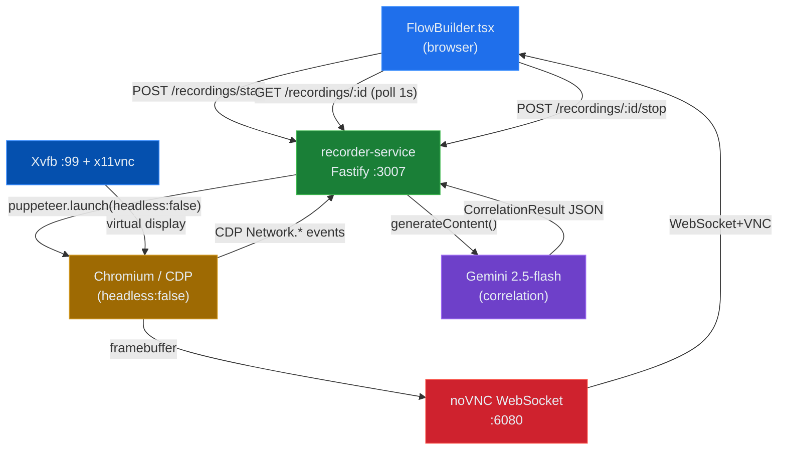
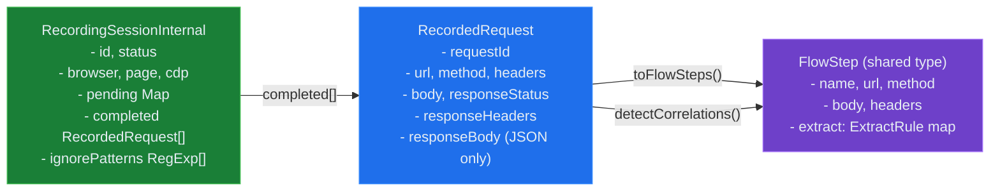

# module-recorder-service — Flow Recorder & AI Correlation

## Business Logic Overview

The recorder-service enables users to record real browser sessions and convert them into reusable multi-step flow definitions (`FlowStep[]`). The user navigates their application inside a Docker-hosted Chromium browser (visible via noVNC at port 6080); the service captures all XHR/fetch/navigation exchanges over CDP; on stop it converts captures to `FlowStep[]` and runs Gemini to auto-detect correlation points (auth tokens, CSRF tokens, session IDs). The enriched steps are returned to `FlowBuilder.tsx` and are immediately ready for load testing—no manual scripting required.

The service is explicitly optional: `docker-compose.yml` declares no `depends_on` for it, and `GET /system/health` shows it as `unreachable` rather than degrading the platform when it is absent.

---

## Architecture Overview

---

## Component Analysis

### index.ts — REST Session Manager

**Responsibilities:** session lifecycle (CRUD), ephemeral in-memory store, viewer HTML, CORS.

Key design choices:
- Two in-memory `Map` objects: `sessions` (active `RecordingSessionInternal`) and `completedResults` (TTL cache, pruned every 5 min, items expire after 10 min). Avoids any database dependency, keeping the service stateless relative to the platform DB. `index.ts:12-21`
- `buildApp()` factory accepts injected maps for testability. `index.ts:25-28`
- `GET /viewer/:id` (`index.ts:136-237`) serves an inline control panel HTML page that opens noVNC in a new tab and communicates back to `FlowBuilder.tsx` via `window.opener.__recordingDone()`. This is a cross-window postMessage-adjacent pattern; however it relies on `window.opener` being set, which works only when the viewer tab was opened by the parent window—a fragile assumption.
- The `stopping` status is masked as `active` to the polling UI (`index.ts:83`), so the client never observes an intermediate state. Clean UX contract.
- Error on stop is handled gracefully: falls back to `session.completed` already accumulated. `index.ts:113-115`

### recorder.ts — CDP Capture Engine

**Responsibilities:** launch Chromium, attach CDP, filter and accumulate `RecordedRequest[]`, convert to `FlowStep[]`.

Key design choices:
- Three-event CDP pipeline: `requestWillBeSent` → `responseReceived` → `loadingFinished`. The `pending` and `responseHeaders` maps act as a join buffer keyed by `requestId`. This correctly handles concurrent in-flight requests. `recorder.ts:142-206`
- Response body is fetched only for JSON content types (`ct.includes('json')`). `recorder.ts:183-189`. This is correct for correlation (only JSON responses can yield JSONPath correlations), but misses `text/plain` tokens and binary-encoded JWTs in non-JSON bodies.
- `shouldSkip()` applies three filter layers in priority order: scheme block (`data:`, `blob:`, `chrome-extension:`), extension block (`.js`, `.css`, images, fonts, etc.), content-type block, then user patterns. `recorder.ts:41-49`
- `compileIgnorePatterns()` supports both plain substring patterns and slash-delimited regex. `recorder.ts:54-67`
- `toFlowSteps()` applies a hard cap of 20 steps (`recorder.ts:74`) and skips responses with status >= 500. A header allow-list strips 17 browser-internal headers while preserving custom/application headers. `recorder.ts:88-98`
- Self-reference anti-pattern: `session.stepCount = completed.length` inside the `loadingFinished` closure references `session` before the `const session` declaration at `recorder.ts:208`. This works due to JavaScript closure semantics (captured by reference, not value), but is a readability smell flagged by ESLint's `no-use-before-define` suppression comment at `recorder.ts:203`.

### correlator.ts — Gemini Correlation

**Responsibilities:** build a compact traffic summary, call Gemini, parse `CorrelationResult`, apply `ExtractRule` entries to `FlowStep.extract`.

Key design choices:
- `buildSummary()` slices to 15 requests and caps `requestBody` at 500 chars and `responseBody` at 1000 chars. `correlator.ts:48-63`. This bounds token cost but may truncate tokens used for correlation (a JWT can exceed 500 chars).
- Response header filter in `buildSummary()` is intentionally narrow: `/set-cookie|x-auth|authorization|token|location/i`. This correctly reduces noise but will miss custom token headers not matching these patterns.
- `applyCorrelations()` sanitises `variableName` to `[a-z0-9_]` and falls back to `var_N` on empty result. `correlator.ts:72`. Out-of-bounds `sourceStepIndex` values are silently dropped. `correlator.ts:69`
- The function is best-effort: any exception returns the unenriched steps. `correlator.ts:124-127`. Gemini quota exhaustion, parse failures, and network errors all degrade gracefully.
- No retry logic. A single Gemini call per stop event; 429 rate-limit causes silent skip. This contrasts with `ai-service` which has a 3-attempt backoff loop.
- `detectCorrelations` creates a new `GoogleGenerativeAI` instance on every call (`correlator.ts:104`), bypassing SDK-level connection pooling if the SDK supports it.

### logger.ts

Pino logger with `service: 'recorder-service'` base field and `redact` on `['envVars', 'testData', 'csvData']`. `logger.ts:4-10`. The redacted paths match the platform-wide convention but are unlikely to appear in recorder-specific log payloads (those are flow testing fields, not recording fields). Captured `headers` and `responseBody` containing tokens are logged only at `debug` level (`recorder.ts:205`), which is appropriate.

### Dockerfile

- Two-stage model is not used. All build steps happen in a single layer group, then `chown -R node:node /app` and `USER node`. `Dockerfile:46-53`
- Installs `websockify` via `pip3 install --break-system-packages`. This is the only Python dependency and mixes package managers. It creates a risk surface if Alpine's Python packaging constraints change.
- The entrypoint script (`/docker-entrypoint.sh`) is copied after `RUN chown` (`Dockerfile:48`), so the entrypoint is owned by root but executed by `node`. The `chmod +x` runs before the `USER` switch so execution permission is set correctly. However, the `COPY` after `USER node` would fail on ownership, but here the COPY and chmod occur before `USER node`, so execution is correct.
- Port 6080 is exposed alongside 3007. The noVNC port carries unauthenticated VNC traffic.

### docker-entrypoint.sh

- Cleans stale X11 lock files before starting Xvfb, critical for container restarts without recreation. `docker-entrypoint.sh:9`
- Polls for X11 socket with 50 iterations × 200ms = 10s max wait. `docker-entrypoint.sh:16-20`. Falls back gracefully with a warning if Xvfb does not start.
- `x11vnc` is started with `-nopw` (no VNC password). `docker-entrypoint.sh:26`. This is intentional for local dev but is a significant exposure if port 5900 or 6080 is accidentally exposed.

---

## Design Patterns & Anti-patterns

**Patterns applied correctly:**
- In-memory TTL cache with background pruner for completed sessions avoids DB coupling. `index.ts:14-21`
- CDP three-event join buffer correctly handles concurrent in-flight requests. `recorder.ts:142-206`
- Best-effort AI enrichment: correlation failure never blocks the primary response. `correlator.ts:124-127`
- Factory function (`buildApp`) enables unit testing without port binding. `index.ts:25`

**Anti-patterns and risks:**
- `window.opener.__recordingDone()` in the viewer HTML (`index.ts:215-218`) is a global function assignment. If the opener navigates away or is cross-origin, the call silently fails with no user feedback beyond the "Done" label.
- No input validation on `POST /recordings/start`. The `targetUrl` field is passed directly to `page.goto()` (`index.ts:61`) without URL validation via `new URL()`, allowing arbitrary navigation targets including `file://` paths or internal container addresses (`http://postgres:5432`).
- In-memory session store means a service restart loses all active sessions. The UI polling loop (`GET /recordings/:id` every 1s) will receive 404 with no recovery path.
- The 20-step hard cap in `toFlowSteps()` (`recorder.ts:74`) silently drops steps exceeding the limit without informing the user.
- Gemini `GoogleGenerativeAI` instantiated per call (`correlator.ts:104`) rather than as a module singleton.

---

## Data Architecture

`RecordedRequest` is the central intermediate type bridging raw CDP events to the shared `FlowStep` contract. Response bodies are kept in memory for the duration of the session—for long recordings with many large JSON responses this could accumulate significant memory without a per-session cap.

---

## Integration Patterns

- **UI → recorder-service:** direct HTTP over `VITE_RECORDER_URL` (default `http://localhost:3007`). The UI constructs this URL at build time from the Vite env var, so the recorder URL is baked into the SPA bundle. In production, this requires the recorder service to be reachable from the user's browser, which conflicts with the prod compose stripping internal ports.
- **results-service → recorder-service:** health check only, via `RECORDER_URL` env var. No functional coupling.
- **No message queue:** recorder-service is fully synchronous REST, appropriate for its use case (one-shot session recording).
- **No auth on recorder endpoints.** The `POST /recordings/start` and `POST /recordings/:id/stop` endpoints are not protected by `X-API-Key` middleware present in api-service and results-service. Any caller with network access to port 3007 can start an unlimited number of Chromium instances.

---

## Quality Observations

**Technology fit:** puppeteer-core + CDP is the correct choice for non-headless browser recording. CDP's `Network.*` domain provides request IDs, response metadata, and body retrieval in a single connection—the alternatives (HAR export, proxy interception) are more complex and less reliable. noVNC over Xvfb is the pragmatic solution for Docker-hosted GUI applications; the 60 MB image overhead is the known cost of that stack.

**Filter quality:** The static asset filter is robust for the common case. The extension and MIME-type blocklists cover all standard asset types. The gap is dynamic asset URLs (e.g. a `/api/image` endpoint that returns PNG) where the extension check would not fire; only the content-type check on `responseReceived` would catch it, and `shouldSkip` at request time passes it through to `pending` map before `responseReceived` can filter it. This means the response body fetch is skipped (correct) but the request still appears in `completed[]` as a step.

**Correlation accuracy:** The Gemini prompt is well-structured with concrete output schema instructions and a markdown-fence extraction fallback. The main accuracy risks are: (1) tokens larger than the 500/1000 char body caps being truncated mid-value, (2) response header filter missing non-standard token headers, (3) the 15-request slice limit dropping correlations from later steps in longer flows.

**noVNC alternatives:** `websockify` is the reference WebSocket-to-VNC bridge and has no lighter drop-in replacement for the same feature set. If the image size is a concern, the entire Xvfb+x11vnc+noVNC stack could be replaced by running Chromium with `--remote-debugging-port` exposed and using the Chrome DevTools Protocol's built-in screencast (`Page.startScreencast`) to stream JPEG frames to the UI directly—eliminating the VNC layer and saving approximately 40-50 MB of APK packages.

---

## Engineering Insights

1. **Missing session authentication** is the most actionable security gap. `POST /recordings/start` should require the same `X-API-Key` header enforced by other services. Each unguarded call spawns a full Chromium process; an attacker with network access to port 3007 can exhaust container memory.

2. **`targetUrl` SSRF vector.** `page.goto()` is called with an unvalidated URL (`index.ts:61`). Inside the Docker network the recording browser can reach `http://postgres:5432`, `http://rabbitmq:15672`, etc. Adding `new URL()` validation plus an allowlist or blocklist of internal scheme/host combinations would close this.

3. **Correlation retry parity.** `ai-service` uses 3-attempt backoff for Gemini calls; `correlator.ts` uses none. A single transient 429 silently produces unenriched steps. Adding one retry with a short delay would improve reliability without user-visible latency impact.

4. **Memory bound for long sessions.** `RecordedRequest.responseBody` is accumulated unbounded in `session.completed[]`. A 60-minute recording session of a verbose API could accumulate hundreds of MB. A per-session cap on total body bytes stored (with a warning logged when hit) would prevent OOM.

5. **20-step silent truncation.** The `slice(0, 20)` in `toFlowSteps()` (`recorder.ts:74`) drops captured steps without any user-visible signal. The `/recordings/:id` poll returns `stepCount` which may be higher than the steps returned at stop—a confusing mismatch. The response should include a `truncated: boolean` field or the cap should be surfaced in the viewer HTML.

6. **`window.opener` cross-origin fragility.** The viewer HTML's `window.opener.__recordingDone()` call works only when the viewer tab is synchronously opened from `FlowBuilder.tsx` in the same origin. A `BroadcastChannel` or `localStorage` event would be a more robust cross-tab communication mechanism.
