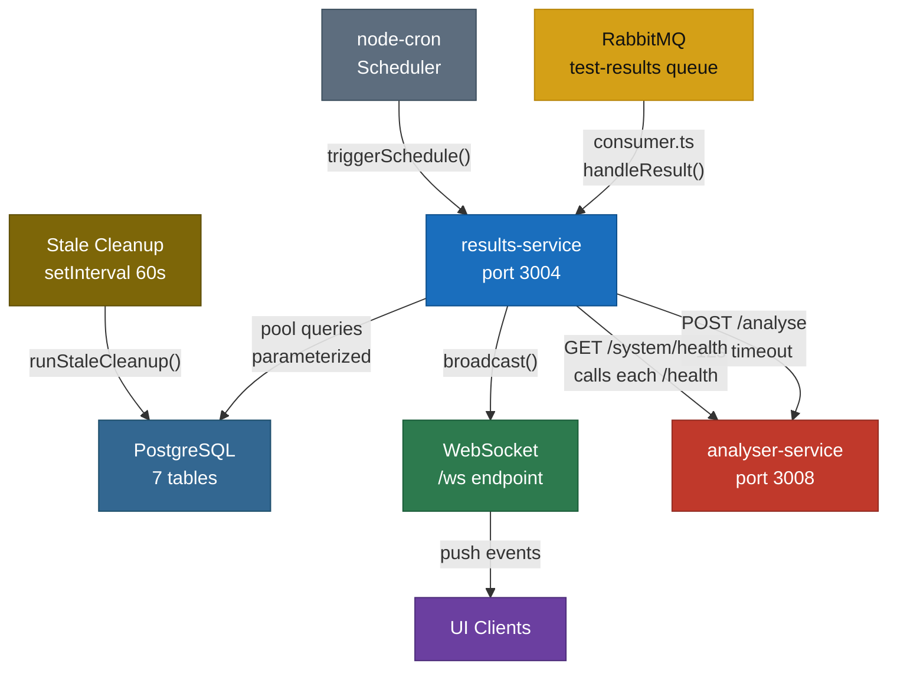

# module-results-service — Central Data Hub & API Server

## Business Logic Overview

The results-service is the persistence and coordination backbone of the platform. It receives completed test payloads from RabbitMQ workers, persists them in PostgreSQL with performance analysis, and serves a unified REST API consumed by both the UI and other internal services. It additionally owns: WebSocket push to UI clients, scheduled test triggering via node-cron, stale-test cleanup, schema initialization and migrations, system health aggregation, PDF report generation, and webhook fan-out on degraded/failed results.

Every other service either reads from or writes to this service. That centrality is load-bearing by design, but it also means all operational concerns accumulate here.

---

## Architecture Overview

**Startup sequence** (`index.ts` lines 13–19): `initDb` → `startConsumer` → `startScheduler` → `startStaleCleanup` → `buildApp` (listen). The ordering matters: schema must exist before the consumer processes its first message, and the pool must be initialized before the app starts serving.

---

## Component Analysis

### index.ts — Orchestration entry
Clean sequential boot with a single `try/catch` that calls `process.exit(1)` on any startup failure. No graceful shutdown handler (`SIGTERM`/`SIGINT`) is implemented; connections are not drained before exit. This is the primary operational gap — Docker sends SIGTERM on `docker stop` and the process terminates abruptly, potentially dropping in-flight DB transactions.

### app.ts — REST API (663 lines)
Contains 34 route handlers across 9 resource groups. All use `pool` directly (injected via parameter — testable). Notable patterns:

- The `onRequest` auth hook (lines 25–32) exempts URLs by string comparison, including a suffix-based match (`endsWith('/running')`, `endsWith('/fail')`, `endsWith('/message')`). A malformed path like `/results/../../running` would still match. The exemption also trusts `testId` in the path without format validation — a UUID check would prevent routing accidents.
- The `/results/pending` endpoint (line 178) is globally exempt from auth. This is an internal contract with api-service and worker services, which is intentional, but the exemption is path-string equality only — no IP allowlist or service token.
- `GET /system/health` (lines 69–108) fires 6 parallel `fetch` calls with 3s `AbortSignal.timeout`. The self-check duplicates the logic in `GET /health` rather than delegating to it.
- Live metric broadcast in `POST /results/:testId/live` (line 270) uses `setImmediate(() => broadcast(...))` to defer broadcast after the HTTP response is sent. This avoids head-of-line blocking on the worker's outbound socket — a sound micro-optimization.
- `GET /results` (line 164) returns at most 50 rows with no cursor pagination. As the table grows this becomes a progressively slower full-scan with a filesort on `created_at DESC`.
- The PDF report handler (lines 550–658) builds the document in memory, buffering all chunks in a `Buffer[]` array, then sends the concatenation. For very large reports this can produce memory spikes.

### consumer.ts — RabbitMQ consumer
`handleResult` (lines 59–135) wraps the core DB write in an explicit `BEGIN/COMMIT/ROLLBACK` transaction using a dedicated client from the pool, which is correct. The `callAnalyserService` call happens inside the connection scope but outside the transaction (between `ROLLBACK` and `COMMIT`) — actually it runs before the transaction INSERT, so a slow analyser call (up to 12s) holds the `client` checked out from the pool for the full duration. With `WORKER_CONCURRENCY > 1` this can exhaust the default pool size (10 connections) when multiple results arrive simultaneously.

**Resolved finding:** an earlier pass of this analysis flagged the webhook header as an unsigned `X-Webhook-Secret` raw-secret header. Re-checked against the current code: `fireWebhooks` (consumer.ts) computes `createHmac('sha256', secret).update(body).digest('hex')` and sends it as `X-Webhook-Signature: sha256=<hmac>`, exactly matching `docs/ARCHITECTURE.md`'s Security Architecture section ("Webhook HMAC: `X-Webhook-Signature: sha256=<hmac-sha256(secret, body)>` computed server-side"). Signing applies to any webhook with a `secret` configured regardless of `format` — a follow-up gap where only `format: 'generic'` webhooks were signed (`slack`/`pagerduty`/`opsgenie` deliveries carried no signature) has since been fixed. `docs/api.md`'s webhook field table describes the secret as an HMAC signing key, consistent with this.

Retry logic re-publishes to the same queue (line 180) rather than using a dead-letter exchange TTL. This means retry messages compete with new messages for the same consumer slot instead of waiting in a separate DLQ with back-pressure.

### analyzer.ts — Deterministic analysis
Pure functions (`analyzeBackend`, `analyzeClient`) with no side effects — appropriately stateless. The degradation threshold is a hard-coded 20% regression constant (lines 97, 199): `Math.abs(d.diffPercent) > 20`. This is not configurable per request and is separate from the user-supplied `SLOThresholds`. A result can be marked `degraded` even when all SLO thresholds pass if any metric regresses by more than 20%.

The `getDiffStatus` function (line 21) treats ±10% as "same", which suppresses noise but means a 15% regression shows as "worse" while the degradation gate requires >20% — creating a three-state "worse but not degraded" window where diffs show red in the UI but `perf_status` stays "passed".

### db.ts — Schema and pool
`createSchema` executes 15 sequential `pool.query` calls with `CREATE TABLE IF NOT EXISTS`, `ALTER TABLE ADD COLUMN IF NOT EXISTS`, and `CREATE INDEX IF NOT EXISTS`. This is an in-process migration strategy rather than a versioned migration tool (Flyway, golang-migrate, or similar). The approach works for additive migrations but cannot safely handle: column renames, type changes, adding NOT NULL without a default, or dropping columns. The `DO $$ BEGIN ... END $$` block for the `test_templates → test_presets` rename (lines 55–61) is correct but does not record that the migration ran, so it re-executes on every startup.

The pool is created at module load time (line 5) with no explicit `max`, `idleTimeoutMillis`, or `connectionTimeoutMillis` settings. The `pg` default pool max is 10. Under high concurrency (multiple workers posting live metrics, handleResult holding a client for 12s analyser calls, and API queries) the pool can saturate, leading to queued requests and increased response latency.

### scheduler.ts — node-cron
`activeTasks` (line 19) is a module-level `Map` — it persists as long as the process is alive, which is the correct lifetime for in-process scheduling. `registerSchedule` (line 47) stops an existing task before replacing it, preventing duplicate registrations on reload.

No cron expression validation occurs before inserting into the DB (app.ts line 449). node-cron will throw at `cron.schedule()` call time (in `reloadSchedule` after the INSERT), but the record is already persisted. A subsequent restart would call `startScheduler` which would throw on the invalid expression — potentially blocking service startup.

### cleanup.ts — Stale test cleanup
Uses `('running' AND started_at < ...)` and `('pending' AND created_at < ...)` with parameterized interval construction via string concatenation of an integer variable (`$1 || ' minutes'`). The `runningMinutes` parameter comes from `parseInt(process.env.STALE_RUNNING_MINUTES ?? '15')` in `index.ts` — if the env var is set to a non-integer the `parseInt` returns `NaN`, which is injected into the SQL as the string `"NaN"`, causing a PostgreSQL error. A `Number.isFinite` guard should be applied.

### ws.ts — WebSocket server
The `noServer: true` pattern with manual `upgrade` event handling (lines 20–31) is the correct Fastify v5-compatible approach — `@fastify/websocket` is locked to Fastify v4. The implementation is minimal and correct. The `clients` Set removes entries on `close`, `error`, and failed `send`, preventing memory leaks.

One gap: there is no heartbeat/ping mechanism. Browsers behind load balancers or proxies that enforce idle TCP timeouts will have their connections silently dropped without the server side detecting the disconnect until the next failed `send`.

---

## Design Patterns & Anti-patterns

**God Service** — The results-service is a textbook God Service: it handles REST API, WebSocket, RabbitMQ consumption, scheduling, stale cleanup, schema management, health aggregation, PDF generation, and webhook delivery. Each of these is a distinct bounded context. In the current scale (a developer tool running in Docker Compose), this is pragmatic and acceptable. If the platform were to scale horizontally, the following splits would have the highest ROI:

1. Extract the **scheduler** into `scheduler-service`: it has its own DB table, its own cron state, and its own external dependency (api-service). Running multiple replicas of results-service today would cause every replica to independently trigger scheduled tests.
2. Extract the **PDF report generation** into a request-scoped handler or a lightweight lambda — it is CPU-bound and memory-intensive, and currently blocks the Fastify event loop during PDF buffering.
3. The **stale cleanup** could remain co-located but must use a distributed lock (Redis `SET NX`) before running to be safe with horizontal scaling.

**Transaction scope** — `handleResult` uses correct `BEGIN/COMMIT/ROLLBACK` with a dedicated client, which is the right pattern for multi-step writes.

**Parameterized queries** — All SQL in the module uses `$N` placeholders throughout. No string interpolation of user input is present, eliminating SQL injection.

---

## Data Architecture

Seven tables are managed by `createSchema`. Key observations:

- `test_results.test_id UUID NOT NULL UNIQUE` (line 24 db.ts) — the natural identity from external callers. The `id` UUID surrogate key is redundant since `test_id` is already unique and indexed. Queries universally use `test_id`, not `id`.
- `live_metrics` has no foreign key to `test_results.test_id` (line 94 db.ts). Orphaned live metric rows can accumulate when tests are deleted (no DELETE endpoint exists for test_results either).
- No data retention or TTL strategy exists. `live_metrics` rows are written at a per-test configurable interval (admin-set via Settings — 10s/30s/1min, default 30s) and are never purged. With soak tests running for hours and multiple workers, this table will grow unbounded.
- The `test_results` table stores `steps JSONB` and `test_data JSONB` (lines 111–112 db.ts) — both potentially large arrays — alongside all metrics and analysis. This means a `SELECT *` on `GET /results` (returning 50 rows) deserializes all JSONB including step data for every row, even when the caller only needs summary fields.

---

## Integration Patterns

- **analyser-service**: called via HTTP with `AbortSignal.timeout(12000)` (consumer.ts line 27). The 12-second timeout prevents indefinite pool-client lockup but is long enough to impact throughput when analyser is slow. The `null`-return fallback to `analyzeResult` is correct.
- **Webhook delivery**: fire-and-forget with `Promise.allSettled` (consumer.ts line 40). Failures are silently swallowed. No retry, no dead-letter, no delivery log. For a webhook system where the operator needs to know if deliveries failed, this is insufficient.
- **api-service (scheduler trigger)**: the `triggerSchedule` and `/schedules/:id/run` handler both POST to api-service without an API key (scheduler.ts line 23, app.ts line 498). When `API_KEYS` auth is enabled on api-service, scheduled tests would fail with 401.

---

## Quality Observations

**Test coverage** is strong: 991-line `api.test.ts` uses real PostgreSQL via Testcontainers, covering all REST endpoints; `consumer.test.ts` covers `handleResult` with webhook assertions; `analyzer.test.ts` is pure unit tests. Gaps: `ws.ts` has a test file (`ws.test.ts`) present in glob results but the WebSocket reconnect, heartbeat absence, and broadcast-under-load scenarios are not validated; the `NaN` interval injection path in `cleanup.ts` is untested; the analyser-service-call-within-pool-client scenario is not tested.

**Error handling uniformity** is inconsistent. Some routes return `reply.code(500).send({ error: '...' })` while others (e.g. `GET /results/:testId` line 214) have no try/catch, propagating Fastify's default 500 handler with a different response shape.

**Logging** uses Pino with `redact` for `envVars`, `testData`, `csvData`. The logger is correctly instantiated with the service name. However, consumer.ts line 167 logs `testId` after parsing but before validation — if `JSON.parse` throws on malformed content, the error is caught but the `testId` binding in the child logger is stale (from the outer scope, which is `undefined` at that point).

---

## Engineering Insights

1. **Horizontal scaling requires scheduler extraction first.** Multiple replicas of results-service as currently designed will each independently fire all scheduled tests. This is the highest-priority architectural risk before any scale-out.

2. **Webhook HMAC is implemented (finding resolved).** `consumer.ts` (`fireWebhooks`) computes `sha256=hmac-sha256(secret, body)` and sends it as `X-Webhook-Signature`, matching `docs/ARCHITECTURE.md`'s documented Security Architecture. This was previously reported as a gap; that report was stale. Signing now applies to any webhook with a `secret` configured, regardless of `format` (`generic`, `slack`, `pagerduty`, `opsgenie`) — the earlier gap where only `format: 'generic'` was signed has been fixed.

3. **Pool connection starvation under concurrent load.** The default `pg` pool of 10 connections, combined with a `client` held for up to 12 seconds during `callAnalyserService` — while an active `BEGIN` transaction is open — creates a bottleneck at `WORKER_CONCURRENCY > 1`. The analyser call happens inside the transaction scope (after `BEGIN`, before the final UPSERT), so the client cannot be released early. Setting an explicit `max: 20` and moving the analyser call before `BEGIN` would raise the ceiling.

4. **Schema migrations need sequencing.** The `DO $$ BEGIN` rename block and `ADD COLUMN IF NOT EXISTS` lines run on every process start. They are idempotent but add startup latency and cannot express ordering guarantees. Adopting a migration tool (even a simple numbered-SQL approach) would make schema evolution auditable and safe across rolling deploys.

5. **Cron expression validation should gate persistence.** Validate the cron string with `cron.validate(expression)` before the DB INSERT in `POST /schedules` to prevent startup-blocking invalid records.

6. **`GET /results` pagination is missing.** The hard `LIMIT 50` (app.ts line 167) without a cursor will silently drop older results from the UI. A `?before=<timestamp>` or `?offset=<n>` parameter is needed as the dataset grows.

7. **No SIGTERM handler.** Adding `process.on('SIGTERM', async () => { await app.close(); pool.end(); process.exit(0); })` would allow graceful drain on container shutdown, preventing in-flight requests from being cut mid-query.
