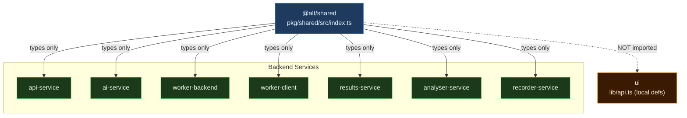
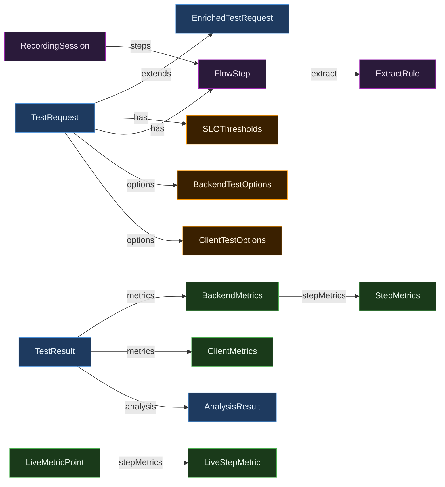

# module-shared — @alt/shared

Single source of truth for all TypeScript types shared across the AI Load Testing Platform monorepo. All 8 service packages import from this module; it has no runtime logic.

---

## Business Logic Overview

`@alt/shared` (`packages/shared/src/index.ts`) encodes the domain contract of the platform in pure TypeScript types. Its purpose is to prevent structural drift between services that communicate over RabbitMQ messages and HTTP JSON payloads. The module covers four domain areas:

1. **Test lifecycle** — types that describe what a test is, what state it is in, and what its outcome looks like (`TestType`, `TestStatus`, `TestRequest`, `EnrichedTestRequest`, `TestResult`, `AnalysisResult`).
2. **Metrics** — raw output from k6 and Puppeteer workers (`BackendMetrics`, `ClientMetrics`, `StepMetrics`, `LiveMetricPoint`, `LiveStepMetric`, `LighthouseScore`).
3. **Configuration** — inputs that control execution (`BackendTestOptions`, `ClientTestOptions`, `SLOThresholds`, `HttpOptions`, `LoadProfile`).
4. **Recording** — types for the recorder-service browser-capture workflow (`RecordingSession`, `RecordedRequest`, `FlowStep`, `ExtractRule`, `ExtractSource`).

---

## Architecture Overview

The UI is the only consumer that does **not** import `@alt/shared`. It re-declares overlapping types locally in `services/ui/lib/api.ts` (lines 9–92), making it a structural outlier.

---

## Component Analysis

### Type Groups and Their Responsibilities

**Primitive discriminants** (lines 1–3, 65): `TestType`, `TestStatus`, `LoadProfile` are string literal unions used as discriminants across all services. `TestType` now includes `'flow'` (line 1), which some downstream interfaces treat specially (e.g., `BackendMetrics.stepMetrics` is populated only for flow tests).

**Configuration types** (lines 5–87): `SLOThresholds`, `HttpOptions`, `BackendTestOptions`, `ClientTestOptions` carry user intent from the UI through api-service into the worker queues. These are correctly optional-field-heavy, reflecting that most parameters have service-level defaults.

**Message envelope types** (lines 49–63, 168–175): `TestRequest` and `EnrichedTestRequest` are the RabbitMQ message schemas. `EnrichedTestRequest extends TestRequest` (line 168), adding fields that api-service and ai-service append in transit (`generatedScript`, `cachedScript`, `cachedScriptDescription`, `scriptCacheKey`). This inheritance cleanly represents the progressive enrichment pattern.

**Result and analysis types** (lines 89–125, 127–156): `AnalysisResult`, `MetricDiff`, `AiInsights`, `TestResult`, `BackendMetrics`, `ClientMetrics` model what a completed test produces. `TestResult` (line 113) is the schema used on the `test-results` RabbitMQ queue; results-service reads it in `consumer.ts` line 167.

**Recording types** (lines 193–214): `RecordedRequest` and `RecordingSession` are used only by recorder-service and the UI. They are logically separated with a section comment (line 193).

---

## Design Patterns & Anti-patterns

### Patterns Applied Correctly

**Progressive enrichment via inheritance**: `EnrichedTestRequest extends TestRequest` (line 168) correctly models message enrichment as it flows through the pipeline — api-service writes `TestRequest` fields, and ai-service adds `generatedScript`/`scriptId`. Inheritance here maps to the actual data flow.

**Discriminated union via `type` field**: `BackendMetrics.type: 'backend'` (line 128) and `ClientMetrics.type: 'client'` (line 149) enable exhaustive narrowing at call sites such as `consumer.ts` line 83 and `analyzer.ts`. The asymmetric literal (`'backend'` vs `'client'`) does not match `TestType`'s `'client-side'` value, requiring callers to know both spellings.

**Optional fields for caller-specific data**: `TestRequest.envVars`, `csvData`, `customScript` (lines 57–61) are optional and documented as "not stored in DB". The comment at line 58 for `testData` says "stored in test_results.test_data for re-run restoration" — but this contradicts `CLAUDE.md` which states testData is NOT stored in DB. This documentation inconsistency in the type file is a reliability risk.

### Anti-patterns

**`description` required on `TestRequest`** (line 53): The field is typed as `string` (not `string | undefined`). When `customScript` is provided, the description is irrelevant, and the UI hides it (per `CLAUDE.md` Phase 16). A required field that has no meaningful value in a subset of valid states is a leaky abstraction — it forces callers to pass empty strings.

**`perfStatus` duplicated as inline literal**: `AnalysisResult.perfStatus` (line 106) and `TestResult.perfStatus` (line 123) both repeat `'passed' | 'degraded' | 'failed'` as inline literals rather than a named type. If a new status were added, all three locations must be updated separately. A `PerfStatus` alias would unify them.

**`WorkerMetrics` and `ServiceHealth` absent from shared**: These types are defined in `services/ui/lib/api.ts` lines 279–297, not in `@alt/shared`. Yet they represent inter-service data returned by `GET /system/health` from results-service and consumed by the UI. Any service that needed to type the health payload would have to redeclare these.

---

## Data Architecture

### Type Relationships

### Key Structural Observations

**`TestResult` on the wire is narrower than the DB row**: The `TestResult` type (lines 113–125) that travels on `test-results` queue has `testId`, `startedAt`, `completedAt`, `status`, `metrics`, `thresholds`, `scriptId`, `reusedScript`. Fields like `steps`, `durationSeconds`, `statusMessage`, `isBaseline`, and `scriptDescription` exist only in the DB row — there is no shared type for the full DB record shape. The UI defines its own `TestResult` interface in `api.ts` (lines 54–92) with snake_case DB column names (`test_id`, `target_url`, `perf_status`), which diverges entirely from `@alt/shared`'s camelCase `TestResult`.

**`options` typed as union without discrimination**: `TestRequest.options: BackendTestOptions | ClientTestOptions` (line 54) is a union without a discriminant field on the options themselves. Callers must check `type` on the parent `TestRequest` to know which option shape applies. This is workable but creates implicit coupling between `type` and `options`.

**`BackendMetrics.stepMetrics`** (line 138): This field is populated only when `TestType` is `'flow'`, but the type does not capture that constraint. A callee receiving `BackendMetrics` with no `type` on `TestRequest` cannot know whether `stepMetrics` being absent means "backend test" or "flow test with no steps parsed".

---

## Integration Patterns

### RabbitMQ Contract

`TestRequest` (sent by api-service, consumed by ai-service and workers) and `EnrichedTestRequest` (produced by ai-service, consumed by workers) define the message schema. Since RabbitMQ carries opaque byte buffers, both producer and consumer must JSON-serialize/deserialize using these types. There is no runtime schema validation — a type change in `@alt/shared` that is not rebuilt in all consuming images will silently produce undefined fields at runtime.

The `packages/shared` package must be rebuilt (`npm run build:shared`) after any type change. This is a manual step documented in `CLAUDE.md` but not enforced by CI in a way that would catch stale compiled `.js` output in Docker image layers.

### HTTP Contract

`TestResult`, `AnalysisResult`, and `BackendMetrics`/`ClientMetrics` travel over HTTP between workers → results-service → analyser-service. `consumer.ts` line 29 casts the analyser response directly: `return await res.json() as AnalysisResult`. There is no runtime validation of that cast — a schema mismatch (e.g., analyser-service returning an older `AnalysisResult` without `aiInsights`) would silently produce `undefined` accesses downstream.

### UI Isolation

The UI maintains its own parallel type definitions. `FlowStep`, `ExtractRule`, `ExtractSource`, `TestRequest`, `LiveMetricPoint` are all redeclared in `api.ts` (lines 9–52, 130–136). These are structurally compatible with `@alt/shared` at the time of writing but will drift silently under future changes. The UI `TestResult` interface uses DB snake_case keys (`test_id`, `target_url`) while `@alt/shared`'s `TestResult` uses camelCase — these represent entirely different shapes for what is semantically the same domain entity.

---

## Quality Observations

1. **Type comment accuracy**: `TestRequest.testData` comment at line 58 says "stored in test_results.test_data for re-run restoration", but `CLAUDE.md` (Phase 10, Phase 15) is inconsistent across versions: Phase 10 says NOT stored in DB, Phase 15 says restored from steps. The type comment needs to be verified against actual DB schema and migration code.

2. **`description` required when `customScript` present**: Lines 53 and 61 together create a semantic contradiction. Custom script mode bypasses AI generation, making `description` meaningless, yet it is required. This forces the UI (and any API caller) to pass an empty string, which pollutes the semantic history used for `compareDescriptions()`.

3. **No `PerfStatus` type alias**: `'passed' | 'degraded' | 'failed'` appears at lines 106, 123, and also inside `consumer.ts` as a string comparison. A named alias would centralize the set.

4. **`ClientMetrics.fid`**: FID (First Input Delay) was deprecated by Google and replaced by INP (Interaction to Next Paint) in March 2024. The type at line 151 still carries `fid: number`, which means Lighthouse scores collected by worker-client may omit this metric going forward, producing `0` silently.

5. **`RecordedRequest.headers`** (line 200): Typed as `Record<string, string>`. HTTP headers can legitimately have multiple values for the same key (e.g., `Set-Cookie`). The flat map silently drops duplicate headers during CDP capture, which could cause AI correlation to miss cookie-based tokens.

6. **`EnrichedTestRequest.cachedScript`** (line 173): A full k6 script string carried in a RabbitMQ message. For large Puppeteer scripts, this can be several KB per message, impacting queue throughput. No size bound is expressed in the type.

---

## Engineering Insights

**Strength — single build artifact**: Having all types in one file (`index.ts`, 214 lines) keeps the shared contract small, reviewable, and fast to rebuild. The absence of runtime logic means there are no execution-time failures originating here.

**Gap — UI is not a consumer**: The architectural intent of `@alt/shared` is defeated for the UI layer. The UI redefines 6 of the module's types locally, uses snake_case for DB-response fields (which `@alt/shared` does not model), and adds types not present in `@alt/shared` (`WorkerMetrics`, `ServiceHealth`, `AIStatus`, `LogSource`, `Preset`, `Schedule`). This means a type rename in `@alt/shared` is invisible to the UI until the UI's parallel definitions also happen to be updated.

**Gap — no validation boundary**: TypeScript types are erased at runtime. Messages deserialized from RabbitMQ and HTTP responses are cast (`as TestResult`, `as AnalysisResult`) with no schema validation. A minor version skew between service images — which is common in rolling updates — can produce silent data corruption. A lightweight schema library (e.g., Zod) applied at each service's deserialization boundary, using types generated from or consistent with `@alt/shared`, would close this gap without requiring changes to `@alt/shared` itself.

**Gap — `PerfStatus` as informal string**: The `perfStatus` field on `AnalysisResult` (line 106) and `TestResult` (line 123) controls webhook firing, UI badge colors, and regression detection. Its three values are critical to the system's observable behavior. Inlining the literal union rather than exporting a named `PerfStatus` type means refactoring the set of statuses requires grep-and-replace across the codebase.

**Opportunity — `ClientMetrics` alignment**: `SLOThresholds` (lines 5–15) includes `lcp`, `fcp`, `ttfb`, `cls` fields. `ClientMetrics` (lines 148–156) carries `lcp`, `fid`, `cls`, `ttfb`, `fcp`. The threshold type covers all metric fields except `fid`, and includes no threshold for Lighthouse `performance` score — yet the analyzer treats `lighthouseScore.performance < 50` as a threshold violation (per `CLAUDE.md` Phase 1). This implicit threshold should be made explicit in `SLOThresholds` (e.g., `lighthousePerformance?: number`) so callers can override it.
