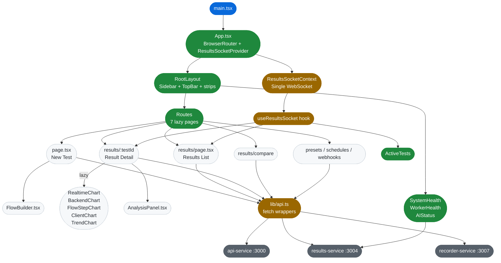

# module-ui — Vite/React SPA Dashboard

This document provides a grounded analysis of the `services/ui` module: a Vite 6 + React Router v7 SPA that serves as the command-center dashboard for the AI Load Testing Platform.

---

## Business Logic Overview

The UI is the primary operator interface for the entire platform. Its responsibilities span three concerns:

1. **Test creation** — collecting type, URL, description, advanced options, SLO thresholds, and flow steps, then POSTing to `api-service:3000`. Includes AI-generated and custom k6 script paths, multi-step flow builder with HAR import and live recording.
2. **Results monitoring** — real-time status updates via WebSocket push, live metric charts during k6 execution, completed result analysis, baseline comparison, and trend tracking.
3. **Configuration management** — CRUD for webhooks, schedules, presets, and log-source deep-link templates. All secondary to testing.

The home page (`app/page.tsx`) is the most complex page, combining test-type switching, NLP-driven form auto-fill, preset management, and the flow builder. It is the effective control surface for Gemini AI-assisted test orchestration.

---

## Architecture Overview

---

## Component Analysis

### Entry and Router (`src/main.tsx`, `src/App.tsx`)

The entry pattern is clean: `main.tsx` mounts `<App>` with `React.StrictMode`; `App.tsx` wraps the entire tree with `ResultsSocketProvider` then `BrowserRouter`. All seven routes are `React.lazy`-loaded and wrapped in a single `<Suspense fallback={null}>` inside `RootLayout`. The fallback is `null` rather than a skeleton — a UX gap discussed under Quality Observations.

Route ordering is intentional: `/results/compare` is declared before `/results/:testId` at `App.tsx:49-50`, preventing the dynamic segment from catching the compare path. This is correct and must be preserved.

### `lib/api.ts` — Fetch Wrapper Layer

The module serves as a typed boundary between the React layer and the backend services. Key observations:

- All functions follow the same flat pattern: `fetch → res.json()` with no error handling (`api.ts:94-101`). Any non-2xx response silently returns whatever JSON the server sends (often an error object), which callers must guard against themselves. None currently do.
- `authHeaders()` at `api.ts:6-7` injects `VITE_API_KEY` from `import.meta.env`. This is client-side auth by design — see Security Gaps.
- `interpolateLogSourceUrl` at `api.ts:337-352` is a pure function performing client-side template substitution. It does not sanitize `result.target_url` before embedding it into the template via `replaceAll`. If a malicious log-source template were created and `target_url` contained characters meaningful to the target logging platform's URL scheme, unexpected behavior could occur.
- `stopRecording` at `api.ts:393-400` applies `AbortSignal.timeout(120_000)` — the only function with a timeout. All other `fetch` calls have no timeout, meaning a hung results-service or api-service will block the calling UI code indefinitely.

### `lib/ResultsSocketContext.tsx` + `lib/useResultsSocket.ts`

The WebSocket architecture is a single-connection pub/sub pattern implemented without a library. One `WebSocket` is opened per app lifetime in `ResultsSocketProvider`, managed inside a `useEffect` with empty deps (`ResultsSocketContext.tsx:26`). Subscribers register via `ctx.subscribe(fn)` and receive a cleanup unsubscriber.

The reconnect strategy uses exponential backoff (1s → 2s → ... → 30s cap at `ResultsSocketContext.tsx:49`). On reconnection a synthetic `'reconnected'` event is emitted so subscribers can force-refresh stale data — `ActiveTests.tsx:24` consumes this.

The `useResultsSocket` hook (`useResultsSocket.ts:18-30`) wraps the subscriber registration in a `useEffect` that depends only on `ctx`. Since `ctx` is a stable `useRef.current` set once at provider mount, the effect runs exactly once per consumer component lifetime. The callback is held in a `useRef` so it can change without triggering re-subscription — a correct pattern.

One gap: there is no heartbeat or ping/pong mechanism. A network path that silently drops the TCP connection without a FIN will leave the `WebSocket` in `OPEN` state indefinitely. Browsers do not detect this without application-level keepalives.

### `app/page.tsx` — Home/New Test Page

At 885 lines, this is the largest single page in the module. It manages 14 `useState` declarations covering form state, preset state, flow steps, test data, CSV upload, env vars, runner selection, and script mode — all in one component. The coupling between these states creates non-obvious interactions. For example, `applyDescriptionParams` at line 169 mutates both `form` (via `setForm`) and `flowRunner` (via `setFlowRunner`) in a single call, which is correct but brittle.

The `useEffect` at line 216 handles three distinct concerns: initial data fetching (presets, results, active tests), re-run parameter restoration from `?rerun=` query param, and URL query param pre-fill from navigation (`type`, `targetUrl`, etc.). These would be cleaner as separate effects with explicit deps. Currently all three execute on every change to `searchParams`, including changes triggered by the preset select dropdown.

The `buildThresholds` function at line 334 does explicit conditional per-type filtering of threshold fields but uses a `const` cast `(thresholds as unknown as Record<string, string>)` at line 809 to work around a TypeScript limitation — a minor type safety issue.

### `app/components/FlowBuilder.tsx`

At 701 lines, `FlowBuilder` is the most complex component. It manages six domains internally:

1. Flow step CRUD (add, remove, reorder, update)
2. HAR file parsing
3. Live recording lifecycle (start, poll, stop, timeout, cancel)
4. Extract variable editor (key, source, expression)
5. Test data inline table (rows, columns, rename, CSV upload)
6. Environment variables CRUD

The recording lifecycle is particularly complex. Two effects manage it: one polls at 1s intervals while `recording.status === 'active'` (`FlowBuilder.tsx:99-130`), and another listens for `visibilitychange` to immediately check status when the user switches tabs (`FlowBuilder.tsx:137-158`). Both effects have ESLint suppression comments (`// eslint-disable-line react-hooks/exhaustive-deps`) because they use `recording` state indirectly via `recordingRef`. The pattern is correct but relying on mutable refs to avoid deps is a signal that this logic would benefit from a dedicated custom hook.

The `(window as any).__recordingDone` property at `FlowBuilder.tsx:167` is a cross-tab communication mechanism using `window.opener`. It works because the viewer tab is opened on the same origin via Vite proxy (`/viewer` → recorder-service). The mechanism is fragile: if the user closes the FlowBuilder component while a recording is active, the cleanup function is not registered, leaving `__recordingDone` pointing at a stale closure.

There is a design inconsistency in CSS: the toolbar row and recording panels use the Command Center palette (`#d0d7de`, `#0969da`), but the step cards themselves use Tailwind utility classes with different border and radius conventions (`border-gray-200 rounded-xl`) that do not match the surrounding page's `border-[#d0d7de] rounded-md`. This was not fully updated during the Phase 6 UI redesign.

### `app/components/SystemHealth.tsx` and `WorkerHealth.tsx`

Both components poll `GET /system/health` every 15 seconds via independent `setInterval` calls. This means two identical fetches fire every 15 seconds. A shared health context would eliminate this duplication.

`SystemHealth` persists its dismissal key in `localStorage` keyed by the sorted service name list (`SystemHealth.tsx:24-25`). The auto-clear logic at line 42 reads `localStorage` inside a `setDismissedKey` updater function — a pattern that works but re-reads storage on every poll cycle.

### `app/components/ActiveTests.tsx`

Uses `useResultsSocket` with a 50ms debounce on `tests:changed` and `test:status` events to coalesce the dual broadcast from consumer. This is a clean pattern. The component renders nothing (`return null`) when no tests are active, which is correct.

---

## Design Patterns & Anti-patterns

**Patterns applied correctly:**
- Single WebSocket connection via context with subscriber pub/sub — avoids N connections for N components
- `React.lazy` + `<Suspense>` for chart-heavy pages — correct for bundle splitting
- Stable callback ref in `useResultsSocket` — prevents spurious re-subscriptions
- Controlled preset select that resets to placeholder after selection — `page.tsx:444-446`
- `visibilitychange` handler as a fallback for throttled intervals in background tabs

**Anti-patterns present:**
- No error boundaries anywhere in the tree. An exception in `RealtimeChart`, `FlowBuilder`, or any chart during rendering will unmount the entire `RootLayout`.
- `fetch` without error handling throughout `api.ts` — callers receive `undefined` or `{ error: string }` objects but treat them as valid data.
- Duplicate `getSystemHealth` calls in `SystemHealth` and `WorkerHealth` — two fetches every 15s for the same endpoint.
- `FlowBuilder` violates Single Responsibility Principle — recording, data parameterization, env vars, extract rules, and HAR import should be separate components.
- Inline regex at `page.tsx:173` for type detection has case overlap (`browser` matches both client-side and could appear in backend descriptions). The `isBrowser && !isBackend` guard mitigates but the logic is difficult to maintain.
- `alert()` at `FlowBuilder.tsx:258` for HAR parse failure — blocks the UI thread and is inconsistent with the error-banner pattern used elsewhere in the component.

---

## Data Architecture

The UI maintains no global state store. All state is local `useState` in individual components or pages. This is appropriate for the current scale but creates redundancy:

- `active` tests are fetched independently by `HomeContent` (once on mount) and `ActiveTests` (WS-triggered). There is no shared cache.
- `getSystemHealth()` is called by both `SystemHealth` and `WorkerHealth` on independent 15s intervals.
- `presets` are fetched in `HomeContent` and re-fetched after save (`page.tsx:317`) but are not available to other pages without a fresh fetch.

The `api.ts` layer defines all domain types (`TestResult`, `TestRequest`, `FlowStep`, etc.) inline rather than importing from `@alt/shared`. This means the shared types package and the UI type definitions can drift. Currently they are manually kept in sync — for example, `api.ts:54-92` redefines `TestResult` locally including `analysis.aiInsights` which matches `@alt/shared`'s `AiInsights` interface but is not imported from it.

---

## Integration Patterns

The UI integrates with three backends:

| Target | Method | Auth |
|--------|--------|------|
| `api-service:3000` | `fetch` POST/GET | `X-API-Key` header |
| `results-service:3004` | `fetch` GET/POST/PUT/DELETE + WebSocket | `X-API-Key` header |
| `recorder-service:3007` | `fetch` via Vite proxy (`/recordings`, `/viewer`) | None |

The Vite dev server proxies `/recordings` and `/viewer` to recorder-service (`vite.config.ts:25-28`), making them same-origin with the SPA. This is necessary for `window.opener.__recordingDone()` cross-tab communication to work since `window.opener` is null for cross-origin tabs.

In production (behind Caddy), the recorder-service proxy is not replicated — Caddy only routes `yourdomain.com`, `api.yourdomain.com`, and `data.yourdomain.com`. The `/viewer` and `/recordings` paths would not be proxied, breaking the recording feature in production unless additional Caddy configuration is added.

---

## Quality Observations

**Test coverage:** The test suite covers 10 files with a mix of RTL component tests and Vitest unit tests. `FlowBuilder.test.tsx` is notably thorough: it covers the recording lifecycle state machine including external stop via polling (404 handling), `visibilitychange`, and the `__recordingDone` window property. `AnalysisPanel.test.tsx` covers the AI insights collapsible panel thoroughly. Coverage gaps: no tests for `WorkerHealth`, result detail page interaction, chart rendering, or the `applyDescriptionParams` NLP parsing logic in `page.tsx`.

**Missing error boundaries:** Every lazy route and every chart component can throw during render. Without error boundaries, a rendering exception in any chart will crash the entire layout shell including navigation. Adding a boundary at the `<Outlet>` wrapper in `RootLayout` would isolate page-level failures.

**Loading state granularity:** The `<Suspense fallback={null}>` at `App.tsx:31` means lazy page chunks load silently — the user sees a blank content area with no spinner. Individual pages show loading states for their own data fetches but not for the initial JS chunk.

**Bundle organization:** `optimizeDeps.include` in `vite.config.ts` is absent — the config only has plugins, resolve alias, server, and proxy. The CLAUDE.md documents that `optimizeDeps.include` pre-bundles key dependencies, but the actual `vite.config.ts` file at line 9-30 does not contain it. Either it was removed or the documentation is ahead of the file. This should be verified; without it, the first request to each Recharts chart chunk will trigger on-demand bundling.

**VITE_API_KEY exposure:** The API key is embedded in the bundled JS at build time (visible in browser DevTools Network tab, source maps, and `dist/assets/*.js`). This is a deliberate tradeoff for a self-hosted developer tool — the CLAUDE.md security notes acknowledge it. For multi-tenant or public-facing deployment, API key authentication would need to shift to a BFF (backend-for-frontend) session cookie pattern.

---

## Engineering Insights

1. **WebSocket provider placement is correct.** Wrapping `BrowserRouter` with `ResultsSocketProvider` in `App.tsx:42-43` means the connection outlives route transitions. If the provider were inside a page component, navigation would close and reopen the WebSocket on every route change.

2. **FlowBuilder should be decomposed.** The component is the correct candidate for a custom hook (`useRecordingSession`) that encapsulates recording state, polling, and visibilitychange handling. The UI rendering and the recording state machine are independent concerns that have grown together due to feature-by-feature additions across Phases 14-15.

3. **`api.ts` should throw on non-ok responses.** A small wrapper (`async function apiFetch(url, init)`) that calls `if (!res.ok) throw new Error(...)` before `res.json()` would propagate fetch errors consistently to callers and enable proper error boundary recovery.

4. **SystemHealth and WorkerHealth should share a health context.** A `HealthContext` provider in `RootLayout` that fetches once every 15s and provides the result to both components would halve the polling load without requiring a global store.

5. **The recording-to-production gap is a deployment blocker.** `RECORDER_URL` is only proxied through Vite's dev server. Any production deployment that wants the Record feature functional must add a Caddy route for `/recordings` and `/viewer` paths pointing to recorder-service. This is not documented in the Caddyfile or production deployment checklist.

6. **Type drift risk between `api.ts` and `@alt/shared`.** Because `services/ui/lib/api.ts` redeclares domain types locally rather than importing from `packages/shared/src/index.ts`, schema changes in the backend types require manual mirroring in the UI layer. The shared package is built separately (`npm run build:shared`) and the UI does consume it for some types (FlowBuilder imports `FlowStep`, `ExtractRule` from `@/lib/api` which re-exports them), but the `TestResult` and analysis types are re-declared. A single import path from `@alt/shared` for the canonical types would eliminate this surface.
