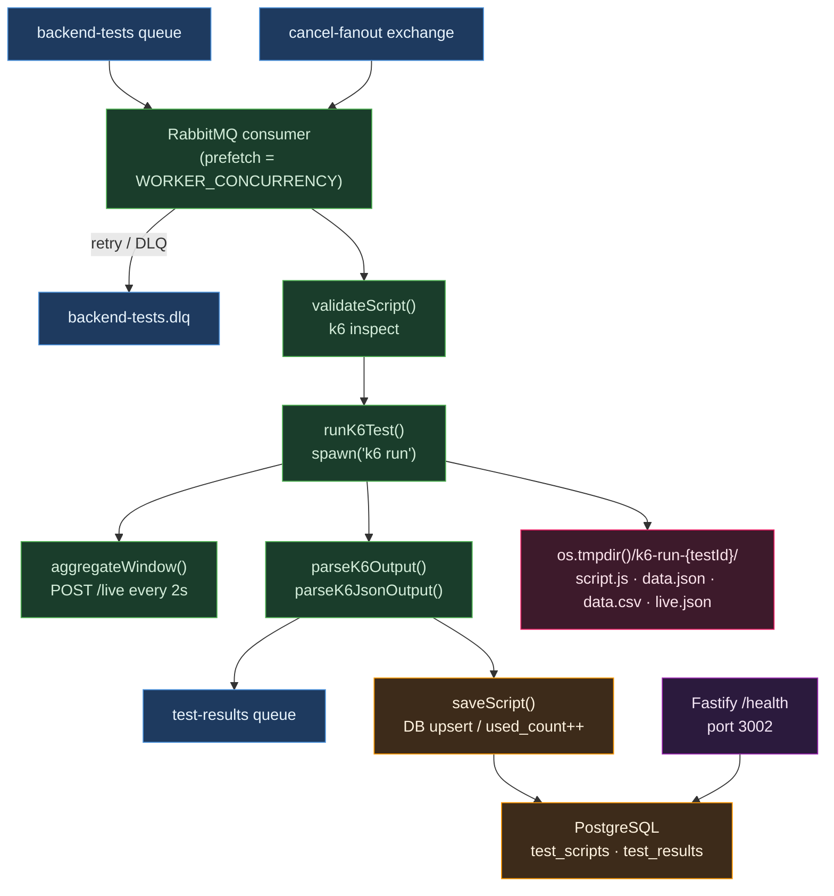
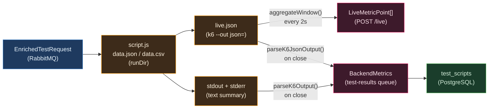

# module-worker-backend — k6 Test Runner & Metrics Parser

Grounded reverse-engineering of `services/worker-backend/src/` against four focus areas:
architectural correctness, technology fit, improvement opportunities, and security gaps.

---

## Business Logic Overview

The worker-backend is the execution engine for all backend and flow-type load tests. It
consumes `EnrichedTestRequest` messages from the `backend-tests` RabbitMQ queue, orchestrates
a full k6 test lifecycle — script validation, data file materialisation, child-process spawn,
live-metric streaming, final metrics parsing, and result publication — and then publishes a
`TestResult` to the `test-results` queue. A lightweight Fastify server on port 3002 provides
`GET /health` for system-health aggregation by `results-service`.

---

## Architecture Overview

---

## Component Analysis

### index.ts — Consumer & Orchestrator

**Concurrency model (index.ts:271)**
`channel.prefetch(WORKER_CONCURRENCY)` caps in-flight messages at the configured limit.
Because each message's handler is `async`, amqplib will not deliver the next message until
`channel.ack` or `channel.nack` is called, so prefetch correctly serialises work at
`WORKER_CONCURRENCY = 1` and parallelises at higher values. This is the canonical approach
for amqplib and is architecturally sound.

**Per-test run directory (index.ts:94–108)**
`os.tmpdir()/k6-run-{testId}/` isolates all artefacts — script, data files, live JSON output —
per test. This is necessary and correct: without it, concurrent workers would overwrite each
other's `data.json`. The directory is cleaned up via `rm -rf` on both success and error paths
(index.ts:171, 202), preventing unbounded disk growth.

**Cancel fanout (index.ts:265–284)**
Each worker replica binds an exclusive auto-delete queue to the `cancel-fanout` exchange on
startup. The cancel consumer sends `SIGTERM` to the running k6 `ChildProcess` and adds the
`testId` to `cancelledTests`. A post-run check (index.ts:310–316) drains any race where k6
exits cleanly before SIGTERM is processed. The 30-second SIGKILL grace (index.ts:161) handles
hung k6 processes. This is solid; the only edge case is that `cancelledTests` is an in-memory
`Set`, so a worker restart forgets cancellation intent — acceptable because cancelled tests are
also marked in PostgreSQL and the consumer checks DB status before execution (index.ts:295–300).

**k6 exit-code semantics (index.ts:177–193)**
Exit code `99` (threshold violations) is treated as a success path: metrics are parsed and
published. Exit code `0` with zero `requestsTotal` is allowed through. Only non-zero, non-99
exits with zero requests are rejected. This is the right model — the platform's own
`analyser-service` is responsible for SLO evaluation, so k6 threshold violations should not
short-circuit result storage.

**`startedAt` accuracy (index.ts:128)**
`setStartedAt` is called immediately after `spawn`, not after the DB `UPDATE status = 'running'`
(index.ts:305). This means `started_at` reflects when k6 actually begins, excluding script
validation latency — precisely what the countdown timer on the UI requires.

**Single-channel design**
The service uses one AMQP channel for both `backend-tests` consumption and `test-results`
publishing. A channel failure (e.g., from a malformed publish) would silently kill both paths.
Using separate channels for consumer and producer is a standard resilience practice and is
missing here.

**`testLog.info({ metrics }, 'k6 test completed')` (index.ts:336)**
Logging the full `BackendMetrics` object at INFO level on every test completion will produce
large log entries in high-throughput environments. `stepMetrics[]` can be an array of many
entries. This is low severity but worth noting.

---

### parser.ts — Metrics Extraction

**`parseK6Output` — text-summary parser (parser.ts:9–53)**
Extracts aggregate metrics by regex over k6's human-readable summary. The regexes are
deliberately anchored per metric name and handle all three k6 time units (`ms`, `s`, `µs`).
The `getCount`/`getRate` pattern (`\d+ [\d.]+\/s`) correctly reads the two columns k6 prints.
`getFailRate` matches `http_req_failed[^:]*:\s*([\d.]+)%` — this is the only path that
computes `requestsFailed`, which is an estimate (`Math.round(total * failRate / 100)`) and
can differ by ±1 from the true integer count when the failure percentage is not a clean
multiple of `1/total`.

**`parseK6All` — single-pass JSON parser (parser.ts:58–126)**
A unified pass over the NDJSON output file that simultaneously collects status codes, error
breakdown, and per-step (group) metrics. Previously these were two separate exported functions;
the refactor to `parseK6All` with thin wrappers (`parseK6Errors`, `parseK6GroupMetrics`)
eliminates a second full parse of the potentially large JSON file. This is a well-executed
DRY improvement.

**p95 computation for step metrics (parser.ts:114–120)**
The implementation sorts all collected duration values in memory and uses
`floor(n * 0.95)` as the index. This is the "nearest rank" method and is correct for a
post-test aggregate over all k6-collected samples. For very large tests it allocates a
clone of every `http_req_duration` value per group into a `number[]`; at 100 VUs × 300s
× 10 RPS this could be ~300 000 entries per group. This is an accepted tradeoff given
k6 tests run for minutes, not hours.

**Error categorisation (parser.ts:97–101)**
k6 error codes 1020–1029 and 1210 map to `timeout`; 1010–1019 and 1050 map to `networkError`;
anything else with an `error_code` tag but no `status` tag falls through to `networkError`
as a catch-all. This covers the documented k6 error code ranges. Codes outside these ranges
(e.g., a future k6 version adding new codes) silently fall into `networkError`, which is
a safe degradation but could produce misleading categorisation.

**`aggregateWindow` window semantics (parser.ts:149–207)**
The function processes all JSON lines accumulated since the last `readAndPost` call —
not a fixed 2-second window of wall time. `LIVE_WINDOW_SEC = 2` is used only as the
denominator for RPS (`requestCount / 2`). If `readAndPost` is called at irregular intervals
(e.g., if k6 stalls), the denominator stays `2` while the numerator grows, inflating
the reported RPS. A timestamp-based window boundary would be more accurate.

**`vus` reported as `max` (parser.ts:201)**
`vus` is reported as `max(vusValues)` from the window rather than `avg` or the last value.
This matches what the UI charts want to display (peak concurrency in the window) but is
worth noting as a semantic choice.

---

### logger.ts

A three-line Pino logger with `redact` on `envVars`, `testData`, and `csvData`
(logger.ts:5–11). This is the correct pattern for structured logging of `EnrichedTestRequest`
objects: any accidental spread of the full test object into a log call will not expose
credentials or parameterisation data. The `service: 'worker-backend'` base field enables
log filtering across the multi-service stack.

---

## Design Patterns & Anti-patterns

**Patterns in use**

| Pattern | Location | Assessment |
|---|---|---|
| Prefetch-based back-pressure | index.ts:271 | Correct |
| Per-run isolation via tmpdir | index.ts:94 | Necessary; correct |
| Retry with header counter | index.ts:219–238 | Standard AMQP pattern |
| Fanout cancel exchange | index.ts:266–267 | Correct for replica scaling |
| Single-pass multi-output parse | parser.ts:58 (`parseK6All`) | Good DRY refactor |
| Redact-at-logger | logger.ts:10 | Defence-in-depth |

**Anti-patterns / gaps**

| Issue | Location | Severity |
|---|---|---|
| Single AMQP channel for both consume and publish | index.ts:260, 330 | Medium |
| Module-level `setInterval` for CPU sampling never cleared | index.ts:19–25 | Low |
| `LIVE_WINDOW_SEC` is a denominator constant, not a real window boundary | parser.ts:149, 194 | Low |
| `requestsFailed` derived from float percentage, not integer count | parser.ts:46 | Low |
| `testLog.info({ metrics })` logs full metrics array at INFO | index.ts:336 | Low |

---

## Data Architecture

Two independent parsing paths feed `BackendMetrics`:
- `parseK6Output` reads the human-readable summary from stdout+stderr for aggregate metrics
  (avg, p50, p95, p99, rps, requestsTotal, requestsFailed).
- `parseK6JsonOutput` reads the NDJSON file for per-request detail (statusCodes,
  errorBreakdown, stepMetrics).

Both are merged at index.ts:183–187. This dual-source design is intentional: k6's text
summary is the authoritative source for aggregate percentiles (computed by k6 internally
with high precision), while the JSON stream provides the per-request tag data needed for
breakdown and per-group metrics.

---

## Integration Patterns

**RabbitMQ**
- Consumes `backend-tests` with `prefetch(WORKER_CONCURRENCY)`.
- Publishes `test-results` on the same channel. No publisher confirms are used, so
  published messages are not guaranteed durable if the broker restarts between publish and
  the broker's flush — a known tradeoff for throughput.
- Cancel fanout uses `noAck: false` on the cancel consumer (index.ts:285), meaning cancel
  messages are acked even when the target test is not running on this replica. This is correct.

**results-service (HTTP)**
`postLiveMetric` is fire-and-forget (index.ts:69–77): errors are swallowed. This prevents
live-metric failures from interrupting a test run but means dropped live points produce no
alerting. The `setStartedAt` and `updateStatus` calls go directly to PostgreSQL rather than
through the REST API, bypassing results-service validation logic — acceptable given worker-backend
is a trusted internal service, but creates dual write paths.

**k6 process**
k6 is spawned with `--out json=<path>` for machine-readable per-request data plus the text
summary on stdout. The `--summary-trend-stats avg,min,med,max,p(90),p(95),p(99)` flag ensures
p99 is always present in the text output (index.ts:123). The `k6 inspect` dry-run (index.ts:79–83)
validates the script is syntactically executable before committing resources.

---

## Quality Observations

**Test coverage**
`parser.test.ts` contains 25 tests covering all four exported functions. Edge cases covered
include empty input, malformed JSON, all three time units, the `::` root-group filter, and the
single-item duration array (p95 = the single value). The `requestsFailed` averaging calculation
is covered by a dedicated test (parser.test.ts:442–463) with an explicit comment explaining
the `avg × total` formula. Coverage is comprehensive for a parsing module.

**Missing integration tests**
There are no tests for `index.ts`. The RabbitMQ consumer loop, cancel handling, retry logic,
`saveScript`, and the `runK6Test` orchestration are not unit- or integration-tested. Mocking
`child_process.spawn` in Vitest to test cancel/timeout/retry paths would provide significant
regression protection.

**Dockerfile — k6 installation**
The Dockerfile attempts the APK repository approach first and falls back to a pinned GitHub
release download (v0.54.0) on failure (Dockerfile:7–11). The fallback is deterministic and
reproducible, but the primary attempt adds a network round-trip and a silent failure path
that makes build logs harder to read. Pinning to the direct download as the only path would
be simpler and equally reproducible.

**`npx tsx` in production CMD**
`CMD ["npx", "tsx", "src/index.ts"]` (Dockerfile:38) runs TypeScript via tsx in the
production container rather than compiled JavaScript. This adds ts-node overhead and includes
devDependencies at runtime. The `build` script in package.json produces `dist/index.js` via
`tsc`; a production CMD of `["node", "dist/index.js"]` would be faster and smaller.

---

## Engineering Insights

**Architectural correctness verdict**
Spawning k6 as a child process is the correct and only viable approach: k6 is a Go binary with
its own runtime, scheduling, and output format. The per-test runDir strategy is correct for
concurrent execution. The `prefetch`-based concurrency control is idiomatic amqplib.

**Technology fit verdict**
k6 is the industry standard for scripted HTTP load testing. Fastify as a sidecar health server
alongside a queue-consumer main loop is well-suited: both loops share the Node.js event loop
without conflict because the consumer is I/O-bound (waiting on amqplib and child-process events)
and the health server handles infrequent requests.

**Top improvement opportunities**

1. Split AMQP channel: use a dedicated channel for publishing to `test-results` so a publish
   error does not take down the consumer.
2. Replace `npx tsx` CMD with `node dist/index.js` in the production Dockerfile.
3. Timestamp-anchor the `aggregateWindow` denominator using the earliest and latest `time`
   fields in the parsed lines rather than the fixed `LIVE_WINDOW_SEC = 2` constant.
4. Add Vitest unit tests for `index.ts` by mocking `child_process.spawn` to cover retry,
   cancel, timeout, and validation-failure paths.
5. Consider replacing the `requestsFailed` float-percentage derivation in `parseK6Output`
   with a direct count from `parseK6JsonOutput` (which has the exact integer count from
   the NDJSON stream) and merging them after the dual-parse, eliminating the ±1 rounding error.

**Security gaps verdict**
The envVar injection guard (`/^[A-Z_][A-Z0-9_]*$/i`, `\n`/`\0` strip, length cap) at
index.ts:116–119 is applied correctly before constructing the `spawn` argument list.
Because `spawn` is called with an explicit argument array (not a shell string), shell
injection via argument content is not possible. The remaining gap is that `customScript`
content — a user-supplied k6 script — is validated only by `k6 inspect` (syntax check),
not for content (e.g., exfiltration attempts via k6's `http` module). This is an accepted
tradeoff: k6 runs inside a Docker container with no outbound restrictions, so content
policy enforcement would require network egress filtering at the infrastructure layer.
