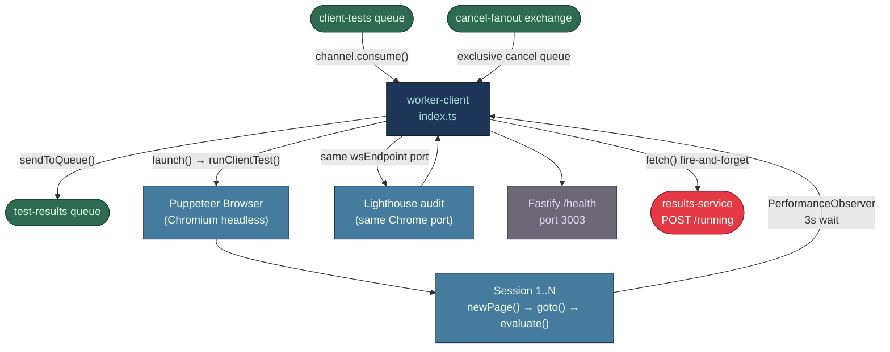

# module-worker-client — Puppeteer Browser Testing & Web Vitals

Single source file: `services/worker-client/src/index.ts` (296 lines).
Supporting: `src/retry.ts`, `src/logger.ts`, `Dockerfile`, `package.json`.

---

## Business Logic Overview

The worker-client service executes synthetic browser tests against a target URL. It receives
`TestRequest` messages from the `client-tests` RabbitMQ queue, launches a headless Chromium
instance via Puppeteer, runs N sequential browser sessions to collect Web Vitals (LCP, FID, CLS,
TTFB, FCP), then performs a single Lighthouse audit reusing the same Chrome process. Averaged
metrics are published to the `test-results` queue for persistence by `results-service`. A
Fastify health endpoint on port 3003 exposes CPU %, memory, and active-test count for the
`/system/health` aggregation in `results-service`.

The service covers one test type: `client-side`. Flow tests sent with `type: 'client-side'` and
`steps[]` arrive here too, but the worker ignores the steps array and navigates only to
`test.targetUrl` (index.ts:85); multi-step browser execution is not implemented for this worker.

---

## Architecture Overview



---

## Component Analysis

### RabbitMQ Consumer (`start()`, index.ts:182–265)

- Connects to RabbitMQ with a 10-attempt / 5 s retry loop (index.ts:185–199). This is
  unstructured polling; no backoff. A permanent RabbitMQ outage will exhaust retries in 50 s and
  crash the process, relying on Docker `restart: unless-stopped` for recovery.
- `channel.prefetch(WORKER_CONCURRENCY)` (index.ts:212) limits in-flight messages to the
  concurrency cap (default 2). This is the correct approach for back-pressure.
- The cancel-fanout consumer uses an exclusive, auto-delete queue
  (index.ts:208) — each replica gets its own queue, so cancels broadcast correctly to all
  instances.

### `runClientTest()` (index.ts:51–180)

**Browser launch** (index.ts:55–63): `puppeteer.launch({ headless: true })` with four
`--no-sandbox` / `--disable-*` flags. A single `Browser` object is created per test.

**Session loop** (index.ts:77–127): Sessions run sequentially in a `for` loop. Each session opens
a new page, creates a CDP session, navigates with `waitUntil: 'networkidle2'` and a 30 s timeout
(index.ts:85), injects a `page.evaluate()` block that registers four `PerformanceObserver`
instances and awaits a hard-coded `setTimeout(..., 3000)` (index.ts:120), then reads the
accumulated values.

**TTFB measurement** (index.ts:84–86): TTFB is measured as `Date.now()` before `page.goto()`
minus `Date.now()` after. This includes DNS resolution, TCP handshake, TLS, and the time for the
browser to fire the `networkidle2` event — it is not equivalent to the W3C Navigation Timing TTFB
(`responseStart - requestStart`). The actual TTFB will be systematically overstated.

**LCP capture** (index.ts:95–98): The observer uses `{ buffered: true }` and picks
`entries[entries.length - 1].startTime`. This is correct for buffered LCP candidates but only
reflects what was rendered within the 3 s observation window — SPAs that hydrate after 3 s will
report 0 or a partial LCP.

**FID capture** (index.ts:100–105): FID requires a real user interaction. In a headless,
unscripted session no first input occurs, so `fid` will always be 0. The W3C replacement metric
(INP — Interaction to Next Paint) is not collected.

**Lighthouse audit** (index.ts:131–159): Lighthouse receives the `wsEndpoint` port and navigates
to `test.targetUrl` independently. All open pages are closed first (index.ts:133–134) to give
Lighthouse a clean browser state. On error, Lighthouse failure is non-fatal (index.ts:157–159);
the test still completes with Web Vitals only.

**Result averaging** (index.ts:166–179): Arithmetic mean across sessions. No median, p95, or
standard deviation. Outlier sessions — e.g. a first cold-cache hit — will distort the average
without any indication of variance.

### Cancel & Timeout Handling

- **Cancel**: `browser.close()` on the running browser (index.ts:222–224). The post-close
  `cancelledTests.has()` check (index.ts:241–246) prevents publishing a result for a cancelled
  test. There is a window between `runClientTest()` returning and the cancelled check where metrics
  would be ACKed and published if the cancel signal arrived at exactly that moment, but the
  `cancelledTests` set covers this race acceptably.
- **Timeout**: A `setTimeout` wrapping `browser.close()` fires after
  `PUPPETEER_MAX_DURATION_MS` (default 300 s, index.ts:67–70). The Puppeteer call then throws or
  resolves into the cancelled path. There is no SIGTERM signal handling at the process level — the
  only hard boundary is the kill timer.

### Health Server (`startHealthServer()`, index.ts:267–292)

Reports `saturated` when `runningBrowsers.size >= WORKER_CONCURRENCY` (index.ts:277). HTTP 503 is
returned only when `!queueConnected` (index.ts:281); saturation returns 200 with a
`status: 'saturated'` body. CPU sampling via `process.cpuUsage()` delta (index.ts:30–36) uses a
5 s rolling window — accurate for process-level CPU but does not reflect Chromium child-process
CPU since Puppeteer spawns a separate OS process.

---

## Design Patterns & Anti-patterns

**Pattern — Single-use browser instance per test**: One `Browser` per message, closed after
completion. This avoids cross-test page state contamination but increases startup latency (~0.5–1 s
per test for Chromium cold start).

**Pattern — Exclusive auto-delete cancel queue**: Correct fanout isolation per replica
(index.ts:208–209). Each worker independently consumes cancellations without queue naming
collisions.

**Pattern — Non-fatal Lighthouse**: Lighthouse wraps in `try/catch` and logs without throwing
(index.ts:157–159). Appropriate for an optional enrichment step.

**Anti-pattern — Sequential sessions**: Sessions run sequentially in a `for` loop (index.ts:77).
With `WORKER_CONCURRENCY=2` two separate test messages can run in parallel, but the N sessions
within each test are serial. For `sessions=10`, this is 10× the single-session latency. Running
sessions as `Promise.all(pages)` within one browser would reduce wall time, though it would
increase peak memory per test.

**Anti-pattern — Fixed 3 s observation delay**: The `setTimeout(..., 3000)` inside
`page.evaluate()` (index.ts:120) is a blunt instrument. If LCP loads in 800 ms, 2.2 s is wasted.
If the page is slow and LCP finishes at 3.1 s, it is missed. Web Vitals library (from
`web-vitals` npm package) provides promise-based collection with proper termination conditions.

**Anti-pattern — Inaccurate TTFB**: Wall-clock delta around `page.goto()` (index.ts:84–86) is
not TTFB. The W3C Navigation Timing API (`performance.getEntriesByType('navigation')[0]`) provides
`responseStart` as a precise server-response measurement available from within the page context.

**Anti-pattern — FID always zero**: Headless sessions with no user interaction will produce
`fid: 0` for every test (index.ts:100–105). This metric is silently misleading.

**Anti-pattern — No process-level signal handling**: No `SIGTERM` handler is registered. Docker
stop issues SIGTERM; without a handler Node.js will wait `SIGTERM_TIMEOUT` (Docker default 10 s)
before SIGKILL, but in-flight tests will not get a clean close — the open browser instance will be
forcibly killed rather than closed gracefully.

---

## Data Architecture

### Input: `TestRequest` (from `client-tests` queue)

Relevant fields used by this worker:

| Field | Usage |
|---|---|
| `id` | testId in logs, `runningBrowsers` map key, result `testId` |
| `targetUrl` | Passed to `page.goto()` and Lighthouse |
| `options.sessions` | Session loop count (index.ts:73–75) |
| `options.duration` | Destructured but never used in the session loop |
| `thresholds` | Forwarded to `test-results` queue unchanged |
| `steps` | Never read; flow-type browser tests are not step-aware |

`options.duration` is extracted at index.ts:73 but the worker runs exactly `sessions` sequential
visits with no time-based loop; the duration field has no effect on execution.

### Output: `TestResult` (to `test-results` queue)

```
{ testId, targetUrl, status: 'completed',
  metrics: ClientMetrics { type, lcp, fid, cls, ttfb, fcp, lighthouseScore? },
  startedAt: ISO, completedAt: ISO, thresholds }
```

`startedAt` is set to `new Date().toISOString()` at result construction time (index.ts:254), not
when the browser actually started navigating. This timestamp is used by `results-service` for the
countdown timer — there is a mismatch between the stated `startedAt` and when `POST /running` was
fired.

---

## Integration Patterns

- **`POST /results/:testId/running`** is fired fire-and-forget (index.ts:236) immediately after
  receiving the message, before any browser activity. This sets `started_at` in the DB. A
  `fetch()` failure is silently swallowed (`.catch(() => {})`), meaning the test may remain in
  `pending` state from the UI perspective if the call fails.
- **DLQ retry**: `handleRetry()` (retry.ts:6–25) increments `x-retry-count` and republishes up to
  3 times. On exhaustion the message is routed to `client-tests.dlq`. Unlike `ai-service`, this
  worker does not call `POST /results/:testId/fail` after DLQ routing — the test remains stuck as
  `pending` until the stale-cleanup job (results-service, every 60 s) marks it `failed` after 30
  min. This is a latency gap in failure signalling.
- **No live metrics**: The worker does not POST to `/results/:testId/live` during execution. The
  `RealtimeChart` on the UI will be empty for client-side tests. This is by design (no k6 streaming
  equivalent), but not documented as an explicit non-goal.

---

## Quality Observations

- **No unit tests for core logic**: The `src/__tests__/` directory contains `retry.test.ts` and
  `health.test.ts`, but there are no tests for `runClientTest()`, Web Vitals collection, or
  Lighthouse integration. Browser automation is inherently hard to unit-test, but the metric
  averaging function (`avg()`, index.ts:166–169) and the cancel-detection logic are pure enough to
  test without a real browser.
- **`options.duration` dead field**: The field is destructured (index.ts:73) but never used,
  creating a misleading API contract — callers expect duration to influence test execution.
- **`collectWebVitals` flag ignored**: `ClientTestOptions.collectWebVitals` is never read; Web
  Vitals are always collected regardless of this field's value.
- **Pino redact**: The logger is imported from `./logger` (index.ts:19). Assuming it mirrors other
  services, `envVars`/`testData`/`csvData` are redacted. However, `targetUrl` is logged at every
  info level event — for tests against internal systems this is acceptable but worth noting.

---

## Engineering Insights

**Combining Puppeteer and Lighthouse in one worker is architecturally justified** because
Lighthouse reuses the already-running Chrome debugging port (index.ts:137), avoiding a second
browser launch. The trade-off is that a Lighthouse crash could affect the Puppeteer result, but
the current non-fatal catch boundary (index.ts:157–159) contains that risk adequately.

**`WORKER_CONCURRENCY` is safe at the process level** because `channel.prefetch()` (index.ts:212)
prevents RabbitMQ from delivering more messages than the concurrency cap. Each concurrent message
gets its own `Browser` instance tracked in `runningBrowsers`. No shared mutable state exists
between concurrent test executions except the `cancelledTests` set and `runningBrowsers` map,
both of which use testId as key — no collision is possible between different tests.

**The 3 s `setTimeout` within `page.evaluate()` runs inside the browser process** (index.ts:120).
This means the Node.js event loop is not blocked — it awaits the `page.evaluate()` promise — but
the browser tab is held open for 3 s regardless of actual page load time.

**Alpine + system Chromium is the correct approach** for production Docker images.
`PUPPETEER_SKIP_CHROMIUM_DOWNLOAD=true` + `PUPPETEER_EXECUTABLE_PATH=/usr/bin/chromium-browser`
(Dockerfile:13–14) avoids bundling a second Chromium binary that Puppeteer would otherwise
download (~400 MB). System Chromium on Alpine is kept to a minimal, auditable version.

**The `--no-sandbox` flag is a Docker-specific necessity**, not a general security regression. In a
Docker container running as a non-root user (Dockerfile:37: `USER node`) without kernel
capabilities, the Chromium sandbox cannot be initialised. The risk surface is the set of URLs
that users submit — `new URL()` validation in `api-service` prevents malformed URLs but does not
restrict internal network targets, meaning Chromium could navigate to `http://localhost/` or
RFC-1918 addresses reachable from inside the Docker network. This is an SSRF-adjacent risk on
multi-tenant or shared deployments.

**Top three improvement priorities by impact:**

1. Replace the wall-clock TTFB and the fixed 3 s observer window with Navigation Timing API
   entries (`performance.getEntriesByType('navigation')[0]`) to produce accurate, standards-aligned
   metrics.
2. Emit `POST /results/:testId/fail` from the DLQ exhaustion path (mirror `ai-service` behaviour)
   to eliminate the 30-minute stale-cleanup latency on browser test failures.
3. Register a `process.on('SIGTERM', ...)` handler that closes all `runningBrowsers` entries before
   exiting, ensuring graceful shutdown on Docker stop rather than SIGKILL.
