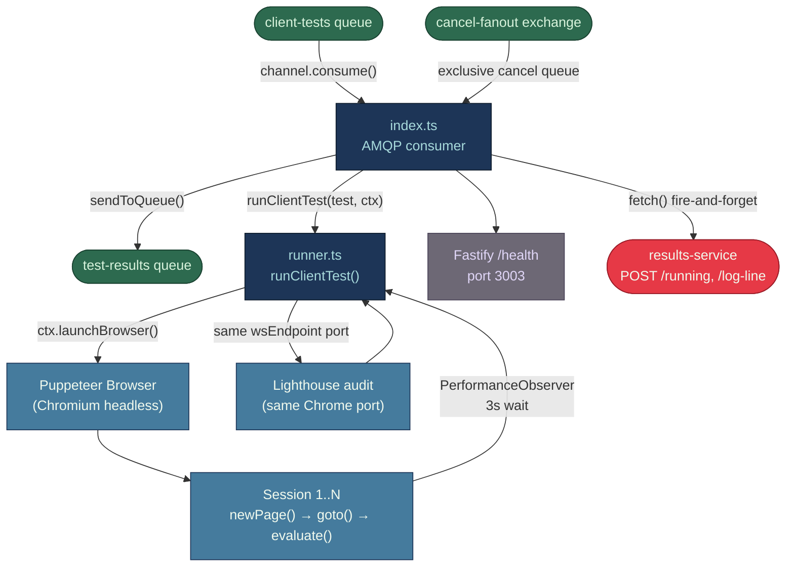

# module-worker-client — Puppeteer Browser Testing & Web Vitals

Two source files: `services/worker-client/src/runner.ts` (~280 lines — core orchestration logic)
and `services/worker-client/src/index.ts` (~212 lines — AMQP consumer shell).
Supporting: `src/retry.ts`, `src/logger.ts`, `Dockerfile`, `package.json`.

The split was introduced to enable unit testing via dependency injection: `runner.ts` exports
`runClientTest(test, ctx)` where `ctx` carries injectable `launchBrowser` and `runLighthouse`
overrides (`ClientRunnerContext`), mirroring `worker-backend`'s `runner.ts` pattern. `index.ts`
is now a thin AMQP consumer that calls `runClientTest` with the production context.

---

## Business Logic Overview

The worker-client service executes synthetic browser tests against a target URL. It receives
`TestRequest` messages from the `client-tests` RabbitMQ queue, launches a headless Chromium
instance via Puppeteer, runs N sequential browser sessions to collect Web Vitals (LCP, FID, CLS,
TTFB, FCP, INP, TBT), then performs a single Lighthouse audit reusing the same Chrome process.
Averaged metrics are published to the `test-results` queue for persistence by `results-service`. A
Fastify health endpoint on port 3003 exposes CPU %, memory, and active-test count for the
`/system/health` aggregation in `results-service`.

The service covers one test type: `client-side`. Flow tests sent with `type: 'client-side'` and
`steps[]` arrive here too, but the worker ignores the steps array and navigates only to
`test.targetUrl`; multi-step browser execution is not implemented for this worker.

---

## Architecture Overview



---

## Component Analysis

### RabbitMQ Consumer (`start()`, index.ts)

- Connects to RabbitMQ via `connectWithBackoff()` (unbounded capped-exponential reconnect, 1s→30s),
  shared with all other queue-connected services. Channel and connection `.on('error'/'close')`
  handlers flip `queueConnected = false` and trigger `scheduleReconnect()`.
- `channel.prefetch(WORKER_CONCURRENCY)` limits in-flight messages to the concurrency cap
  (default 2). This is the correct approach for back-pressure.
- The cancel-fanout consumer uses an exclusive, auto-delete queue — each replica gets its own
  queue, so cancels broadcast correctly to all instances.

### `runClientTest()` (runner.ts)

**Browser launch** (`ctx.launchBrowser ?? puppeteer.launch.bind(puppeteer)`): `puppeteer.launch({ headless: true })` with four
`--no-sandbox` / `--disable-*` flags. A single `Browser` object is created per test.
`ctx.runningBrowsers.set(testId, browser)` tracks it for cancel-signal delivery.

**Session loop**: Sessions run sequentially in a `for` loop. Each session opens a new page,
creates a CDP session, navigates with `waitUntil: 'networkidle2'` and a configurable timeout
(`ctx.navTimeoutMs`, default 60 s), injects a `page.evaluate()` block that registers four
`PerformanceObserver` instances and awaits a hard-coded `setTimeout(..., 3000)`, then reads
the accumulated values.

**TTFB measurement** (runner.ts): TTFB is measured via `performance.getEntriesByType('navigation')[0].responseStart - requestStart`
inside `page.evaluate()` — the W3C Navigation Timing API, which excludes settle time and gives
an accurate server-response measurement.

**INP capture**: Worker collects INP via two paths (priority order):
1. Lighthouse `interaction-to-next-paint` audit (preferred — measures full interaction timeline)
2. PerformanceObserver `event` type (fallback — measures pre-paint duration only)

**FID capture**: FID requires a real user interaction. In a headless, unscripted session no
first input occurs, so `fid` will always be 0. INP has replaced FID as the Core Web Vital
since March 2024; FID is retained for backwards compatibility in `ClientMetrics`.

**Lighthouse audit** (`ctx.runLighthouse ?? lighthouse`): Lighthouse receives the `wsEndpoint`
port and navigates to `test.targetUrl` independently. All open pages are closed first to give
Lighthouse a clean browser state. Extracts INP, TBT, TTI, DOM size, performance/accessibility/
best-practices/SEO scores. On error, Lighthouse failure is non-fatal; the test still completes
with Web Vitals only, and the execution log records "Lighthouse audit failed".

**Result averaging**: Arithmetic mean across sessions via `avgNum()` and `avgResourceBreakdown()`.
No median, p95, or standard deviation.

**Execution log**: Each browser event (navigation, error, console message) is captured via
`addLogLine(level, text)`. On throw, `err.partialLog` is set to the accumulated log lines before
rethrowing, so the AMQP consumer can persist a partial log even for failed tests.

### Cancel & Timeout Handling

- **Cancel**: `browser.close()` on the running browser. The post-close `cancelledTests.has()`
  check prevents publishing a result for a cancelled test.
- **Timeout**: A `setTimeout` wrapping `browser.close()` fires after `ctx.maxDurationMs`
  (default 300 s). The Puppeteer call then throws or resolves into the cancelled path.

### Health Server (`startHealthServer()`, index.ts)

Reports `saturated` when `runningBrowsers.size >= WORKER_CONCURRENCY`. CPU sampling via
`process.cpuUsage()` delta uses a 5 s rolling window — accurate for process-level CPU but does
not reflect Chromium child-process CPU since Puppeteer spawns a separate OS process.

---

## Design Patterns

**Pattern — Dependency injection via `ClientRunnerContext`**: `runClientTest` accepts an optional
`ctx` with injectable `launchBrowser` and `runLighthouse` overrides, enabling pure unit tests
without a real browser. `index.ts` passes production overrides; tests inject mocks.

**Pattern — Single-use browser instance per test**: One `Browser` per message, closed after
completion. Avoids cross-test page state contamination at the cost of ~0.5–1 s Chromium cold start.

**Pattern — Exclusive auto-delete cancel queue**: Correct fanout isolation per replica. Each
worker independently consumes cancellations without queue naming collisions.

**Pattern — Non-fatal Lighthouse**: Lighthouse wraps in `try/catch` and logs without throwing.
Appropriate for an optional enrichment step.

**Anti-pattern — Sequential sessions**: Sessions run sequentially in a `for` loop. With
`WORKER_CONCURRENCY=2` two separate test messages can run in parallel, but the N sessions
within each test are serial. For `sessions=10`, this is 10× the single-session latency.

**Anti-pattern — Fixed 3 s observation delay**: The `setTimeout(..., 3000)` inside
`page.evaluate()` is a blunt instrument. If LCP loads in 800 ms, 2.2 s is wasted.
If the page is slow and LCP finishes at 3.1 s, it is missed.

**Anti-pattern — FID always zero**: Headless sessions with no user interaction will produce
`fid: 0` for every test. This metric is silently misleading (retained for compatibility only).

---

## Data Architecture

### Input: `TestRequest` (from `client-tests` queue)

| Field | Usage |
|---|---|
| `id` | testId in logs, `runningBrowsers` map key, result `testId` |
| `targetUrl` | Passed to `page.goto()` and Lighthouse |
| `options.sessions` | Session loop count |
| `options.duration` | Destructured but never used in the session loop |
| `options.headers` | Applied via `page.setExtraHTTPHeaders()` before navigation |
| `thresholds` | Forwarded to `test-results` queue unchanged |
| `steps` | Never read; flow-type browser tests are not step-aware |

`options.duration` is extracted but the worker runs exactly `sessions` sequential visits with
no time-based loop; the duration field has no effect on execution.

### Output: `TestResult` (to `test-results` queue)

```
{ testId, targetUrl, status: 'completed',
  metrics: ClientMetrics { type, lcp, fid, cls, ttfb, fcp, inp?, tbt?, tti?,
                           jsErrors?, longTaskCount?, domNodeCount?,
                           resourceBreakdown?, lighthouseScore? },
  startedAt: ISO, completedAt: ISO, thresholds, executionLog }
```

---

## Integration Patterns

- **`POST /results/:testId/running`** is fired fire-and-forget immediately after receiving the
  message. A fetch failure is silently swallowed, meaning the test may remain in `pending` state
  from the UI perspective if the call fails.
- **`POST /results/:testId/log-line`** — lines are buffered client-side via `createBatcher()`
  (`@alt/shared`, flushes every 300ms or every 50 lines, whichever comes first — was previously
  one HTTP request per log line, an unordered fetch storm under concurrent verbose tests) and
  sent as `{ lines: [{ level, line }, ...] }`; results-service broadcasts one `test:log` WS event
  per line so the `ExecutionLogPanel`'s real-time streaming is unaffected by the batching.
- **DLQ retry**: `handleRetry()` increments `x-retry-count` and republishes up to 3 times.
  On exhaustion: calls `POST /results/:testId/fail` with `{ executionLog: partialLog ?? null }`
  before routing to `client-tests.dlq` (mirrors ai-service behaviour, avoids the 30-minute
  stale-cleanup latency gap for failed browser tests).

---

## Quality

22 unit tests in `src/__tests__/runner.test.ts` cover `runClientTest` via injected mock
context: basic session flow (7), multi-session metric averaging (1), Lighthouse score/INP/TBT
extraction (5), non-fatal Lighthouse failure (1), `runningBrowsers` lifecycle (2), error
handling including `partialLog` attachment (3), custom headers (2), execution log output (2).

`src/__tests__/health.test.ts` and `src/__tests__/retry.test.ts` cover the health server and
retry logic respectively. `src/__tests__/metrics.test.ts` covers `avgNum`/`avgResourceBreakdown`.

---

## Engineering Notes

**Combining Puppeteer and Lighthouse in one worker is justified** because Lighthouse reuses
the already-running Chrome debugging port, avoiding a second browser launch. The non-fatal catch
boundary contains the Lighthouse crash risk adequately.

**`WORKER_CONCURRENCY` is safe at the process level** because `channel.prefetch()` prevents
RabbitMQ from delivering more messages than the concurrency cap. Each concurrent message gets
its own `Browser` instance tracked in `runningBrowsers` by testId — no collision is possible.

**Alpine + system Chromium is the correct approach** for production Docker images.
`PUPPETEER_SKIP_CHROMIUM_DOWNLOAD=true` + `PUPPETEER_EXECUTABLE_PATH=/usr/bin/chromium-browser`
avoids bundling a second Chromium binary (~400 MB). System Chromium on Alpine is minimal.

**The `--no-sandbox` flag is a Docker-specific necessity** in a container running as a non-root
user (Dockerfile: `USER node`) without kernel capabilities. The Chromium sandbox cannot be
initialised in this environment. `new URL()` validation in `api-service` restricts malformed URLs
but does not block internal network targets — SSRF-adjacent risk on multi-tenant deployments.

**Top improvement priorities by impact:**

1. Replace the fixed 3 s observer window with Web Vitals library promise-based collection
   (`web-vitals` npm package) to avoid missing LCP after 3 s or wasting time on fast pages.
2. ~~Register a `process.on('SIGTERM', ...)` handler~~ — done: `shutdown()` (index.ts) now cancels
   the queue consumer (no new deliveries), drains in-flight message handlers via `drainInFlight()`
   (bounded by `PUPPETEER_MAX_DURATION_MS` + a buffer) before closing the AMQP channel/connection,
   so a scale-down/Docker-stop no longer kills a running test mid-execution.
3. Make `options.duration` influence a time-bounded session loop rather than being silently ignored.
