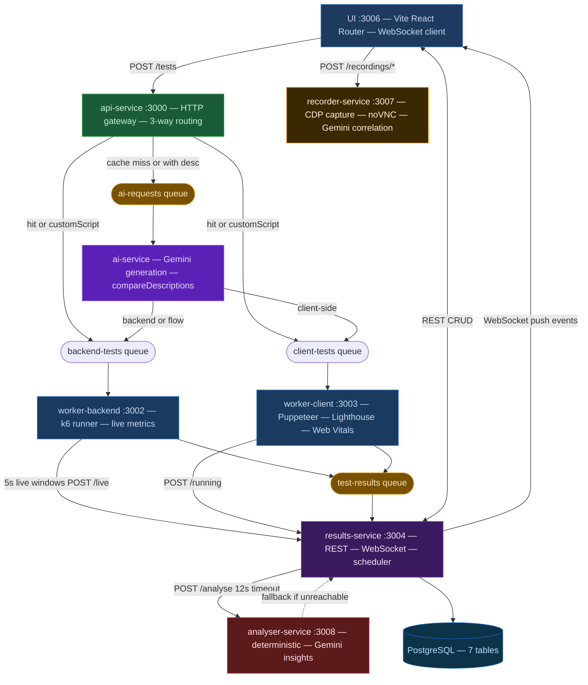

# Cross-Module Architecture Summary — AI Load Testing Platform

Synthesized from nine per-module analysis documents. Every claim is grounded in those sources.

---

## 1. Executive Summary

The AI Load Testing Platform is a well-structured, purpose-built developer tool that successfully delivers its core value: natural-language-driven load test generation, execution, and analysis. The incremental build produced a system that is functionally complete, thoroughly tested (~1600 tests across 64 files: unit, integration via Testcontainers, UI with RTL, and 11 Playwright E2E specs), and deployable to production via Docker Compose and Caddy. The service boundaries are largely correct, the message-queue topology is idiomatic, and the choice to isolate Gemini AI behind dedicated services (ai-service, analyser-service) with explicit fallbacks is architecturally sound.

Three cross-cutting themes dominate the risk landscape. First, AMQP reliability: every service that touches RabbitMQ uses a single channel with no reconnect logic; a broker-level channel error after startup silently corrupts the service without any health signal. Second, type contract drift: the UI re-declares all domain types locally rather than importing from @alt/shared, and analyzer.ts is duplicated verbatim between results-service and analyser-service, creating independent drift surfaces that TypeScript cannot detect across service boundaries. Third, security gaps that survived the Phase 7 hardening: the webhook HMAC is not implemented (raw secret sent instead of computed signature), the recorder-service has no authentication, and the URL validator accepts file:// and other non-HTTP schemes that reach AI generation and worker execution.

The platform is production-ready for single-team, self-hosted use in its current state, but before any horizontal scaling or multi-user exposure these three themes need systematic resolution. No single issue is catastrophic in isolation; their combination under realistic operating conditions constitutes the primary engineering risk.

---

## 2. Architecture Assessment

### Cross-Module Data Flow

### Service Boundary Assessment

| Boundary | Assessment | Rationale |
|---|---|---|
| api-service as sole HTTP entry | Correct | Keeps validation, routing, and auth in one auditable surface |
| ai-service as async consumer | Correct | Decouples Gemini latency from the HTTP request; DLQ retries are independent |
| analyser-service as separate HTTP service | Correct | Prevents Gemini outage from blocking the results-service consumer loop |
| results-service as God Service | Acceptable now, risky at scale | Scheduler + WebSocket + REST + consumer + cleanup in one process; multiple replicas would fire duplicate scheduled tests |
| recorder-service as optional satellite | Correct | No hard dependency; shows as unreachable rather than failed |
| worker-backend / worker-client split | Correct | k6 and Puppeteer have incompatible execution models; a shared worker would be worse |

### Coupling Hotspots

- **results-service** is coupled to every other service: it is the HTTP target for workers, the WebSocket broadcaster for the UI, the scheduler trigger for api-service, the health aggregator for all six services, and the fallback analyzer. Any instability here propagates everywhere.
- **@alt/shared and UI type drift**: the UI is the only consumer that does not import @alt/shared, creating a hidden coupling that manifests as runtime bugs rather than compile errors.
- **AMQP single channel**: api-service, ai-service, worker-backend, and worker-client all share one channel for both consuming and publishing. A channel fault in one direction silences both.

---

## 3. Technology Fit Assessment

| Technology | Verdict | Rationale |
|---|---|---|
| Node.js 20 + TypeScript | Good | Appropriate for I/O-bound queue consumers and API servers; TypeScript provides contract safety across the monorepo |
| Fastify v5 | Good | Correct for low-overhead HTTP; onRequest hook auth and schema validation are available but underused in some services |
| RabbitMQ / amqplib | Acceptable | Correct choice for durable work queues and fanout cancel; amqplib lacks built-in reconnect, requiring manual handling that is currently absent |
| PostgreSQL / pg | Good | Relational model fits structured test results; parameterized queries used consistently; pool defaults too low for concurrent load |
| Gemini AI (gemini-2.5-flash) | Acceptable | Free-tier rate limit (20 req/day) is a real constraint; prompt injection surface exists but is low-risk for single-tenant deployment |
| k6 | Good | Industry standard for scripted HTTP load testing; spawned as child process is the only viable approach |
| Puppeteer 22 + Lighthouse | Acceptable | Correct for synthetic browser testing; FID metric is deprecated; TTFB measurement method is inaccurate |
| Vite 6 + React Router v7 | Good | Correct migration from Next.js; resolves Docker Desktop Windows compilation timeout; optimizeDeps.include documented but absent from actual config |
| ws (noServer: true) | Good | Only viable WebSocket option with Fastify v5; no heartbeat mechanism is a gap |
| Tailwind CSS 4 | Good | CSS-first @theme inline is forward-compatible; consistent token usage with minor gaps in FlowBuilder |
| Pino structured logging | Good | Redact config on envVars/testData/csvData present on 7 of 9 services; ai-service generator bypasses it via console.log |
| node-cron | Acceptable | Adequate for single-replica scheduling; incompatible with horizontal scaling without a distributed lock |
| pdfkit | Acceptable | Buffers entire report in memory before sending; acceptable at current scale |
| @alt/shared pattern | Acceptable | Strong for 7 of 8 consumers; UI non-participation defeats the contract for the most visible integration |

---

## 4. Cross-Cutting Issues

### Real Bugs (Broken Behaviour)

**Critical**

| ID | Affected Modules | Description | Recommendation |
|---|---|---|---|
| B1 | ai-service | Both compareDescriptions (generator.ts:249) and generateScript (generator.ts:271) use model name gemini-3.1-flash-lite, which does not exist in the Gemini API as of mid-2025; both calls fail silently, wasting retry budget and Gemini quota | Define a single MODEL_NAME constant in generator.ts set to gemini-2.5-flash; replace both occurrences |
| B2 | worker-client | options.duration is destructured but never used; collectWebVitals flag is always ignored; FID is always 0 in headless sessions — three metric fields silently misrepresent test execution | Use duration for a time-bounded session loop; remove fid collection or replace with INP; document collectWebVitals as deprecated |
| B3 | worker-client | TTFB measured as wall-clock around page.goto() — includes DNS, TCP, TLS, and networkidle2 settle time; true TTFB is responseStart minus requestStart from Navigation Timing API | Replace with performance.getEntriesByType navigation[0].responseStart inside page.evaluate() |
| B4 | results-service | Webhook sends raw secret as X-Webhook-Secret header; CLAUDE.md specifies X-Webhook-Signature: sha256=hmac; consumers cannot verify payload authenticity | Compute sha256=hmac-sha256(secret, body) and send as X-Webhook-Signature |
| B5 | results-service | Scheduled tests POST to api-service without an API key; when API_KEYS is non-empty in production, all scheduled runs return 401 silently | Add X-API-Key header in triggerSchedule() using a shared internal key from env |
| B6 | results-service | parseInt(STALE_RUNNING_MINUTES) returns NaN for non-integer values; injected into SQL as the string NaN, causing PostgreSQL error on every cleanup cycle | Add Number.isFinite(n) guard with fallback default |

**High**

| ID | Affected Modules | Description | Recommendation |
|---|---|---|---|
| B7 | api-service | fetch to /results/pending has no timeout; slow results-service stalls every POST /tests indefinitely | Add AbortSignal.timeout(5000) |
| B8 | results-service | callAnalyserService holds a pg.PoolClient for up to 12 s; at WORKER_CONCURRENCY greater than 1 this exhausts the default 10-connection pool | Move client release before the analyser HTTP call, or increase pool max to 20 |
| B9 | results-service | Invalid cron expression persisted to DB crashes startScheduler on next service restart | Validate with cron.validate() before INSERT |

---

### Security Gaps

**High**

| ID | Affected Modules | Description | Recommendation |
|---|---|---|---|
| S1 | api-service | new URL() accepts file://, data:, ftp:// schemes; user-supplied file:///etc/passwd passes validation and reaches the worker | Reject if protocol is not http: or https: |
| S2 | recorder-service | POST /recordings/start passes targetUrl directly to page.goto() without validation; recording browser can reach internal Docker network addresses — SSRF risk | Add new URL() validation plus blocklist for RFC-1918 and Docker-internal hostnames |
| S3 | recorder-service | No authentication on any endpoint; any host with network access to port 3007 can spawn unlimited Chromium processes, exhausting container memory | Apply the same X-API-Key guard used by api-service and results-service |
| S4 | recorder-service | noVNC port 6080 carries unauthenticated VNC traffic; x11vnc -nopw in docker-entrypoint.sh | Add a VNC password or restrict port binding to localhost in non-dev environments |
| S5 | api-service, ai-service | customScript up to 512 KB user-supplied k6 JS is validated only for syntax; content policy is not enforced | Document as accepted risk; enforce egress filtering at infrastructure layer for shared deployments |
| S6 | ai-service | test.description, step names, and targetUrl are interpolated verbatim into Gemini prompts; prompt injection via crafted inputs is possible | Truncate and sanitize user strings before embedding; document risk |

---

### Reliability Gaps

**High**

| ID | Affected Modules | Description | Recommendation |
|---|---|---|---|
| R1 | api-service, ai-service, worker-backend, worker-client | AMQP channel created once at startup with no error/close handler; broker-side channel fault leaves the service silently unable to consume or publish; health endpoints report ok | Register channel.on(error) and channel.on(close) handlers that reset the channel reference; implement exponential-backoff reconnect |
| R2 | results-service | No SIGTERM handler; Docker stop kills the process immediately, potentially dropping in-flight DB transactions | Add process.on(SIGTERM) handler that drains requests and closes DB pool before exit |
| R3 | worker-client | DLQ exhaustion does not call POST /results/:testId/fail; browser tests stay pending for 30 minutes until stale cleanup | Mirror ai-service: call fail endpoint before nacking to DLQ |
| R4 | ws.ts and UI ResultsSocketContext | No WebSocket heartbeat; silent TCP drops leave connections in OPEN state on both sides; server clients Set accumulates stale entries | Add setInterval ping on server; detect pong timeout and close socket to trigger client reconnect |
| R5 | results-service | Scheduler runs in-process; multiple replicas each independently trigger all scheduled tests | Extract scheduler to a dedicated service, or add a Redis SET NX distributed lock before each trigger |

---

### Code Duplication and Shared Package Underuse

**Medium**

| ID | Affected Modules | Description | Recommendation |
|---|---|---|---|
| D1 | analyser-service, results-service | analyzer.ts duplicated verbatim; threshold constants and all analysis functions are byte-for-byte copies; a future threshold change must be applied in both files | Move analyzeResult and its types to packages/shared/src/; import in both services |
| D2 | ui (lib/api.ts) | TestResult, FlowStep, ExtractRule, BackendMetrics, ClientMetrics, LiveMetricPoint redeclared locally using snake_case DB field names; incompatible with @alt/shared camelCase representation | Define canonical response shape in @alt/shared matching DB column names; import in UI |
| D3 | ui (SystemHealth, WorkerHealth) | Both components independently call GET /system/health every 15 s — two identical fetches per cycle | Extract HealthContext provider in RootLayout that fetches once and distributes via context |
| D4 | ai-service | console.log/console.error in generator.ts bypass the Pino logger; redact guarantees do not apply to AI generation logs | Replace all console.* calls with the Pino log instance |

---

### Observability Gaps

**Medium**

| ID | Affected Modules | Description | Recommendation |
|---|---|---|---|
| O1 | results-service | Webhook delivery failures silently swallowed; no retry, no dead-letter, no delivery log | Log failed deliveries at WARN with destination URL and status |
| O2 | ai-service | postMessage status update errors silently swallowed | Log at DEBUG level so failures are traceable in structured logs |
| O3 | analyser-service | logger.ts lacks redact config present in all other service loggers; a future log of the request body would expose metric payloads | Add redact paths for metrics and previousMetrics to match project-wide pattern |
| O4 | worker-backend | testLog.info with full metrics serializes BackendMetrics including stepMetrics[] at INFO level on every test | Log only scalar summary fields at INFO; move full metrics to DEBUG |

---

### Test Coverage Gaps

**Medium**

| ID | Affected Modules | Description | Recommendation |
|---|---|---|---|
| T1 | worker-backend | index.ts has no tests; consumer loop, cancel handling, retry logic, saveScript, and runK6Test orchestration are untested | Add Vitest unit tests mocking child_process.spawn to cover retry, cancel, timeout, and validation-failure paths |
| T2 | ai-service | index.ts consumer branching (compare/reuse/regenerate/DLQ) has no unit tests; only covered by Playwright E2E | Extract routing logic to a testable function; add Vitest tests for each branch |
| T3 | worker-client | runClientTest(), Web Vitals collection, and metric averaging function are untested | Test avg() and cancel-detection logic; mock Puppeteer for lifecycle tests |
| T4 | ui | applyDescriptionParams NLP parsing, WorkerHealth component, and result detail page interactions are untested | Add Vitest RTL tests for parsing edge cases and component rendering |
| T5 | results-service | ws.ts reconnect, heartbeat absence, broadcast-under-load, and NaN cleanup interval are untested | Add Vitest tests for cleanup guard and WebSocket send-failure pruning |

---

### Production Readiness Gaps

**Medium**

| ID | Affected Modules | Description | Recommendation |
|---|---|---|---|
| P1 | All workers | CMD npx tsx src/index.ts runs TypeScript in production containers; includes devDependencies at runtime and adds cold-start overhead | Use node dist/index.js after tsc build; already supported by package.json build scripts |
| P2 | results-service | GET /results hard-limits to 50 rows with no pagination cursor; silently drops older results from the UI as the dataset grows | Add ?before=ISO timestamp or ?offset=n cursor parameter |
| P3 | results-service | live_metrics and test_results have no TTL or retention policy; tables grow unbounded | Add periodic cleanup: delete live_metrics older than 30 days; archive test_results older than 90 days |
| P4 | results-service | Schema migrations re-execute on every startup; cannot handle column renames or type changes safely | Adopt numbered SQL migration files with a schema_migrations tracking table |
| P5 | ui / recorder-service | /recordings and /viewer paths proxied only in Vite dev server; Caddy prod config does not route them — recording is broken in production | Add Caddy route for recorder-service or document explicitly in deployment checklist |
| P6 | api-service | stepsToKey() uses JSON.stringify(steps) — property ordering determines the cache key; semantically identical step arrays with different property orderings produce different keys | Sort properties before hashing, or use a canonical step fingerprint |

---

## 5. Improvement Roadmap

### Quick Wins (1–2 file changes each)

| Module | Change | Impact |
|---|---|---|
| ai-service / generator.ts | Extract MODEL_NAME constant; fix compareDescriptions model name (B1) | Eliminates silent Gemini failures on every description comparison |
| api-service / index.ts | Add AbortSignal.timeout(5000) to results-service fetch (B7) | Prevents indefinite request stall |
| api-service / index.ts | Restrict URL validation to http: and https: schemes (S1) | Closes non-HTTP URL security vector |
| results-service / consumer.ts | Compute HMAC for webhook signature header (B4) | Aligns implementation with documented spec |
| results-service / scheduler.ts | Add X-API-Key header to api-service POST (B5) | Fixes silent 401 on all scheduled runs in production |
| results-service / cleanup.ts | Add Number.isFinite guard on interval env vars (B6) | Prevents SQL error on misconfigured env |
| results-service / app.ts | Validate cron expression before DB INSERT (B9) | Prevents startup crash from invalid schedule record |
| worker-client / index.ts | Call POST /results/:testId/fail on DLQ exhaustion (R3) | Eliminates 30-minute pending ghost tests |
| analyser-service / logger.ts | Add redact config (O3) | Brings into parity with all other service loggers |
| ai-service / generator.ts | Replace all console.log/console.error with Pino log (D4) | Restores redact guarantees for AI generation logs |
| ui / SystemHealth.tsx + WorkerHealth.tsx | Extract shared HealthContext provider (D3) | Halves the /system/health polling load |

### Medium Effort (approximately one week each)

| Scope | Description |
|---|---|
| AMQP reconnect across all services (R1) | Add channel error/close handlers with exponential-backoff reconnect in api-service, ai-service, worker-backend, and worker-client; update isQueueConnected() to reflect live channel state |
| analyzeResult extraction to @alt/shared (D1) | Move the deterministic analyzer and its helper types to packages/shared/src/; import from both analyser-service and results-service; eliminates drift risk permanently |
| UI type unification (D2) | Define canonical TestResult response shape in @alt/shared matching DB column names; import in ui/lib/api.ts; remove local redeclarations |
| worker-client metrics accuracy (B2, B3) | Replace wall-clock TTFB with Navigation Timing API; remove FID collection; respect options.duration in session loop; add SIGTERM handler for graceful browser close |
| WebSocket heartbeat (R4) | Add server-side ping on 30 s interval with pong timeout detection; add client-side reconnect trigger on ping timeout |
| results-service SIGTERM handler (R2) | Drain in-flight requests and close DB pool before exit; prevents dropped transactions on container stop |
| worker-backend and worker-client index.ts tests (T1, T2, T3) | Add Vitest unit tests mocking child_process.spawn and amqplib channel; cover retry, cancel, timeout, and DLQ paths |
| recorder-service authentication and SSRF (S2, S3) | Add X-API-Key guard to all recorder endpoints; add URL validation with internal-host blocklist |

### Architectural (multi-sprint)

| Scope | Description |
|---|---|
| Scheduler extraction | Move scheduler state and cron registration to a dedicated scheduler-service; eliminates duplicate test firing when results-service is scaled horizontally; requires Redis or DB-level distributed lock as an intermediate step |
| Numbered SQL migrations | Replace CREATE TABLE IF NOT EXISTS startup migrations with numbered SQL files and a schema_migrations tracking table; enables safe column renames, type changes, and rolling deploy coordination |
| @alt/shared runtime validation | Add Zod schemas alongside TypeScript types in @alt/shared; apply at each AMQP deserialization boundary and at HTTP response boundaries in results-service; closes silent data corruption from image version skew |
| Results pagination and retention | Add cursor-based pagination to GET /results; add TTL-based cleanup for live_metrics and archival for test_results; both required before the platform can operate continuously at scale |
| Production recording support | Add Caddy routes for /recordings and /viewer in docker-compose.prod.yml; document in deployment checklist; current production config silently breaks the recording feature |

---

## 6. What Works Well

The following design decisions are correct and should not be changed:

- **Three-way script routing in api-service** — cache miss / hit-no-description / hit-with-description is placed correctly in the HTTP gateway; it is a stateless classification requiring only a DB read, and the placement avoids coupling ai-service to the cache layer.
- **analyser-service isolation with 12 s timeout and local fallback** — prevents a Gemini outage or quota exhaustion from blocking the results-service consumer loop; the fallback pattern is correct and the budget analysis (5–7 s realistic, 12 s limit) is adequate.
- **Per-test run directory in worker-backend** — os.tmpdir()/k6-run-{testId}/ isolation is necessary and correct for WORKER_CONCURRENCY greater than 1; cleanup on both success and error paths prevents disk growth.
- **cancel-fanout exchange with exclusive auto-delete queues** — each worker replica binds its own queue to the fanout exchange, ensuring cancel signals reach all running instances regardless of scaling factor.
- **WebSocket provider placement in App.tsx** — wrapping BrowserRouter with ResultsSocketProvider means the single WebSocket connection outlives route transitions; placement inside a page component would reconnect on every navigation.
- **prefetch(WORKER_CONCURRENCY) back-pressure** — canonical amqplib approach for concurrency control; correctly prevents over-consumption at both worker-backend and worker-client.
- **Pino redact on envVars/testData/csvData** — present in 7 of 9 services; acts as a safety net preventing credential leakage from accidental full-object log calls.
- **safeTestResponse() in api-service** — destructuring-rest approach is type-safe; TypeScript enforces the input shape, making accidental field inclusion a compile-time error.
- **Non-root containers** — all Dockerfiles apply chown -R node:node /app and USER node; correct and consistent across all six services.
- **EnrichedTestRequest extends TestRequest** — progressive enrichment via inheritance cleanly models message transformation as it traverses the pipeline from api-service through ai-service to workers.
- **parseK6All single-pass refactor in worker-backend** — eliminates a second full parse of the potentially large NDJSON file; a well-executed DRY improvement.
- **Testcontainers integration tests for results-service and api-service** — use real PostgreSQL instances, providing high-confidence regression coverage for all SQL queries and schema migrations.

---

## 7. Open Questions and Assumptions

1. **testData storage ambiguity** — @alt/shared TestRequest.testData comment (line 58) says "stored in test_results.test_data for re-run restoration", contradicting CLAUDE.md Phase 10 which says it is NOT stored in DB. The actual db.ts schema must be verified before any re-run feature work touches this field.

2. **optimizeDeps.include discrepancy** — module-ui.md notes that CLAUDE.md documents optimizeDeps.include as present in vite.config.ts but the actual file does not contain it. If absent, first-request Recharts bundling may reproduce the latency issue that motivated the Next.js migration. Verification needed.

3. **ClientMetrics.fid deprecation timeline** — FID was deprecated by Google in March 2024. Whether the Lighthouse version pinned in the Docker image still populates fid is unknown; if it stops silently, the field returns 0 without any error, producing misleading metrics. Behavior must be verified against the pinned Lighthouse version.

4. **Gemini free-tier quota interaction with compareDescriptions** — the 20 requests/day limit is acknowledged in CLAUDE.md, but description-comparison adds a second Gemini call per test that has a cached script and description. The actual cost impact on typical usage patterns should be measured before the comparison feature is promoted as the default behavior for all users.

5. **stepsToKey() property-ordering collision risk** — JSON.stringify(steps) is order-sensitive on FlowStep objects. If the UI or different code paths produce identical step arrays with different property orderings (common when steps come from HAR import vs manual entry vs re-run restoration), cache keys diverge and force script regeneration. The magnitude depends on whether property ordering is stable across all step-creation paths.

6. **analyser-service /analyse unauthenticated** — the endpoint is internal and not routed by Caddy in production, but this is implicit rather than enforced. If Caddy config changes to expose port 3008, all security assumptions for this endpoint break. Explicit documentation or a simple internal token would remove the dependency on routing-layer protection.
